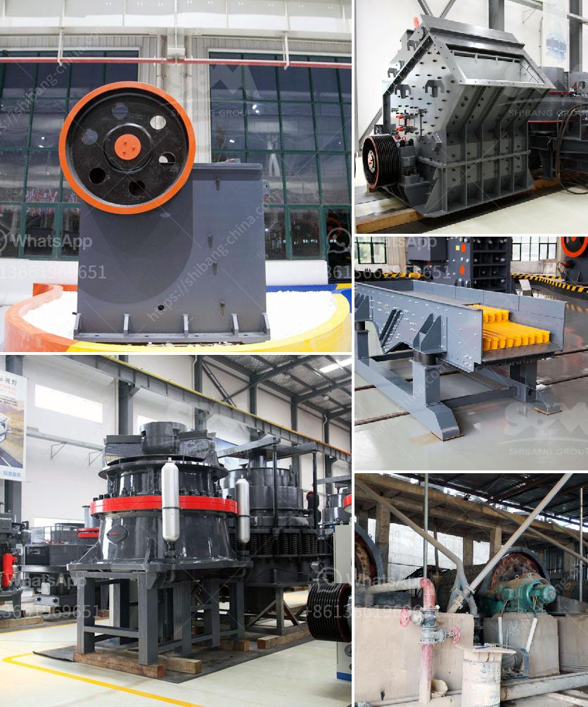

<h3>crushing machine pakistan</h3>
Crushing machines and equipment play a crucial role in various industries, from construction to mining and agriculture. They are designed to break down large rocks, ores, and other materials into smaller, more manageable pieces. In Pakistan, the demand for crushing machines is constantly on the rise due to the continuous growth of infrastructure projects and the need to improve productivity in various sectors.

Pakistan's construction industry has seen significant growth in recent years, with numerous infrastructure projects, such as highways, roads, and bridges, being planned and executed across the country. To meet the demands of these projects, crushing machines are essential. They are used to crush stones, gravel, and concrete, making it easier to transport and use them in construction activities.

In the mining sector, Pakistan is rich in natural resources, including coal, gold, and minerals. Crushing machines are used extensively in mining operations to extract, crush, and process these valuable resources. They facilitate the efficient extraction and beneficiation of ores, making mining operations more cost-effective and environmentally friendly.

Agriculture is another sector that greatly benefits from crushing machines in Pakistan. Farmers use these machines to crush and grind crops, such as wheat, maize, and rice, into animal feed or to prepare them for further processing. This efficient process ensures a high-quality feed for livestock, boosting productivity and profitability in the agricultural sector.

The availability of crushing machines in Pakistan is crucial for the economic growth and development of various industries. Local manufacturers and suppliers have been striving to meet this increasing demand by producing high-quality and efficient machines. However, it is important to ensure that these machines adhere to international safety standards to prevent accidents and ensure worker safety.

In conclusion, the use of crushing machines in Pakistan is vital for the growth and development of industries such as construction, mining, and agriculture. These machines are essential in breaking down materials into smaller pieces, making them easy to transport and use. As the demand for such machines continues to grow, it is essential for the local manufacturers and suppliers to produce and provide safe, efficient, and reliable crushing machines to meet the needs of the market.
<h3>Contact us</h3><ul><li><strong>Whatsapp:&nbsp;<a href="https://wa.me/8613661969651">+8613661969651</a></strong></li><li><a href="https://swt.shibang-china.com/?git&amp;zhl&amp;crushing machine pakistan"><strong>Online Service(chat now)</strong></a></li></ul><h3>Related</h3><ul><li><a href='mobile stone crusher with vibrating screen.md'>mobile stone crusher with vibrating screen</a></li><li><a href='crushing equipment in south africa.md'>crushing equipment in south africa</a></li><li><a href='ball mill di philippines.md'>ball mill di philippines</a></li><li><a href='20mm feeding hydraulic cone crusher price.md'>20mm feeding hydraulic cone crusher price</a></li><li><a href='manufacturing process of bentonite powder.md'>manufacturing process of bentonite powder</a></li></ul>