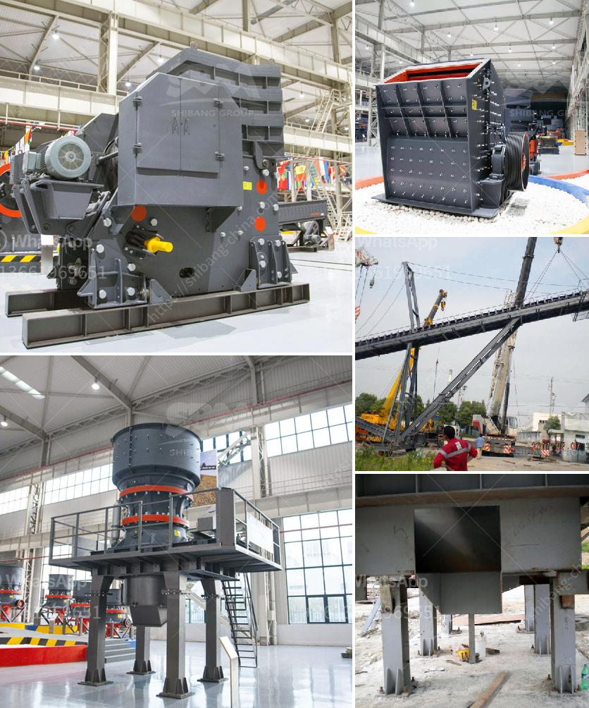

<h3>crushing of coal process</h3>
Crushing of coal process is a complex process that involves a multitude of steps and equipment. It all starts with taking the raw coal material and crushing it into smaller pieces for transportation and further utilization.

Coal plays a vital role in electricity generation worldwide. Coal-fired power plants currently fuel around 38% of global electricity and, in some countries, coal fuels a higher percentage of electricity. Coal is still a key fuel resource for developing countries where there are vast reserves of this fossil fuel.

The crushing process involves a combination of crushing machines that break down the coal into smaller pieces suitable for further processing. These machines include jaw crushers, gyratory crushers, roll crushers, and cone crushers. The sizing and breaking down of coal material to achieve the desired particle size distribution is a crucial step in the coal preparation process.

The crushed coal is then screened to separate it into different sizes and remove any impurities or unwanted materials. This is typically done using vibrating screens that help to sort the coal particles based on their size and quality. The resulting coal is then stored and transported for various applications, such as power generation, industrial use, or coal processing plants.

Crushing coal not only facilitates the transportation and storage of this valuable resource but also enhances its combustion efficiency. By reducing the coal particle size, the surface area available for combustion increases, leading to improved and more efficient burning. This ultimately helps to maximize the energy output and reduce emissions in coal-fired power plants.

Furthermore, the crushing process plays a crucial role in coal washing, which involves separating and removing impurities from raw coal. By crushing the coal, the separation of different coal components becomes easier, enabling effective cleaning techniques for coal beneficiation. This process helps to enhance the quality of coal, making it suitable for various industrial applications.

In conclusion, the crushing of coal process is a fundamental step in the coal preparation process. It not only facilitates the transportation and storage of coal but also enhances its combustion efficiency and improves its suitability for various applications. With the continuous advancements in technology, crushing methods continue to evolve, making the coal industry more efficient and environmentally friendly.
<h3>Contact us</h3><ul><li><strong>Whatsapp:&nbsp;<a href="https://wa.me/8613661969651">+8613661969651</a></strong></li><li><a href="https://swt.shibang-china.com/?git&amp;zhl&amp;crushing of coal process"><strong>Online Service(chat now)</strong></a></li></ul><h3>Related</h3><ul><li><a href='crusher factory in kenya.md'>crusher factory in kenya</a></li><li><a href='concrete crusher price philippines.md'>concrete crusher price philippines</a></li><li><a href='pulverizer for carbon black.md'>pulverizer for carbon black</a></li><li><a href='stone crushers machine malaysia.md'>stone crushers machine malaysia</a></li><li><a href='used crusher machines from china.md'>used crusher machines from china</a></li></ul>