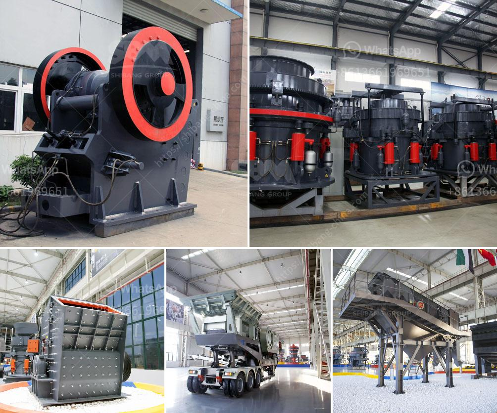

<h3>crushing plant design and layout considerations</h3>
Crushing plant design and layout considerations are crucial factors that dictate the operational efficiency and production effectiveness of a quarry or mining operation. The basic objective of any crushing plant design is to produce high-quality materials efficiently that meet the end-users’ requirements. In this article, we will explore the key aspects to consider while designing a crushing plant and layout considerations.

Firstly, the raw material (quarry or mine) characteristics play a vital role in determining the layout and design of a crushing plant. For example, hardness and abrasiveness of the material, size distribution, moisture content, and clay content can significantly affect the crusher selection and plant layout. It is important to analyze the material properties before selecting equipment to avoid any potential issues during operation. Moreover, the material’s gradation and quality requirements will have an impact on the number and size of crushers needed.

Secondly, the plant layout should aim to maximize the efficiency of material flow throughout the process. This involves the arrangement of equipment, conveyor systems, and stockpiles to optimize productivity and minimize material handling. A well-designed layout reduces unnecessary equipment movement, decreasing operational costs and increasing overall throughput. Additionally, an efficient layout considers the safety and maintenance aspects, providing easy access for maintenance and repair activities.

Thirdly, the selection and configuration of the crushing equipment are crucial in achieving the desired production goals. Factors such as capacity, power requirements, space limitations, and operational cost need to be considered. The type of crusher chosen should depend on the specific requirements of the plant, taking into account the desired end product size and shape. For instance, a cone crusher is typically used for secondary and tertiary crushing to produce a more cubical-shaped end product, while a primary jaw crusher is suitable for primary crushing applications.

Furthermore, environmental considerations should be taken into account during the design process. Implementing environmentally friendly measures, such as dust suppression systems, noise reduction techniques, and water management systems, can help to mitigate the impact of the crushing plant on its surroundings. Proper ventilation and dust control measures are essential to comply with local regulations and provide a safe and healthy work environment.

Lastly, ongoing monitoring and optimization of the plant design are necessary to ensure continuous improvement and adaptability to changing circumstances. Regularly reviewing process parameters, equipment performance, and production data can identify bottlenecks and areas for improvement. Modifying the plant design based on these findings can yield significant benefits in terms of productivity, efficiency, and cost savings.

In conclusion, crushing plant design and layout considerations are essential aspects to consider when setting up a crushing plant for quarrying or mining purposes. The selection of the equipment, the configuration of the plant, and the environmental measures taken all contribute to optimizing the plant’s productivity and efficiency. By paying careful attention to these considerations and continuously monitoring and optimizing the plant design, operators can achieve high-quality materials while minimizing the impact on the environment and maximizing the profitability of their operations.
<h3>Contact us</h3><ul><li><strong>Whatsapp:&nbsp;<a href="https://wa.me/8613661969651">+8613661969651</a></strong></li><li><a href="https://swt.shibang-china.com/?git&amp;zhl&amp;crushing plant design and layout considerations"><strong>Online Service(chat now)</strong></a></li></ul><h3>Related</h3><ul><li><a href='granite crusher processing machines south africa.md'>granite crusher processing machines south africa</a></li><li><a href='safety poster for coal handling plant.md'>safety poster for coal handling plant</a></li><li><a href='marble powder mill.md'>marble powder mill</a></li><li><a href='conveyor belts for sand for sale.md'>conveyor belts for sand for sale</a></li><li><a href='50 tph stone crusher plant price.md'>50 tph stone crusher plant price</a></li></ul>