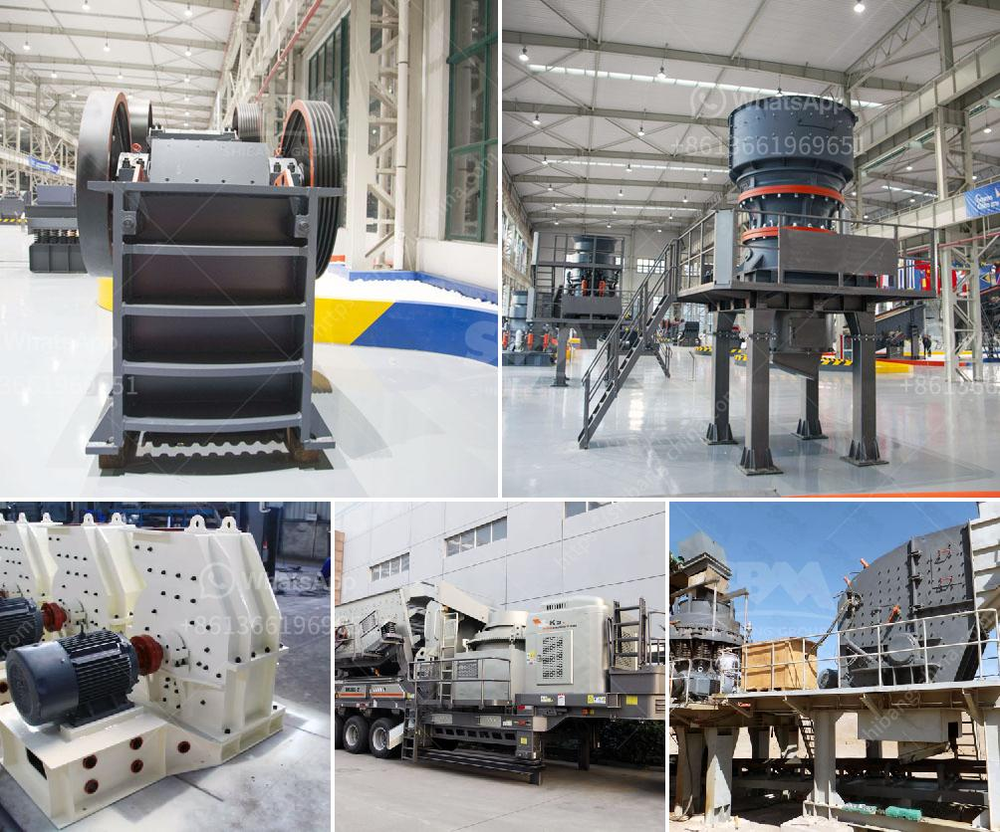

<h3>crushing plant in the philippines</h3>
The Philippines is rich in mineral resources, and mining operations are thriving in the country. Crushing plants are widely used in the mining industry for the crushing and processing of various stones and minerals. The Philippines is one of the busiest mining countries in Southeast Asia.

Indigenous tribes like the Aetas are also engaged in crushing plants. These tribes live in the mountains where they can operate freely and safely away from the bustle of the city. Crushing plants make use of a large range of equipment, such as a pre-screener, loading conveyor, intake hopper, magnetic separator, crushing unit, such as jaw crushers and cone crusher, etc.

Vibration Feeder: These machines feed the jaw and impact crusher with the rocks and stones to be crushed. Crushers: These are the machines where the rocks and stones are crushed. There are different types of crushers for different types of rocks and stones and different sizes of the input and output material.

Each plant would incorporate one or several crushing machines depending on the required final material, gravels or sand or both. Generally, jaw crushers and Gyratory crushers are used for primary crushing, while impact crusher, Symons cone crusher, hammer crusher are used for secondary crushing and tertiary crushing.

Vibrating Screen: These machines are used to separate the different sizes of the material obtained by the crushers. Belt Conveyor: These elements are the belts used for transportation of the material from one machine to another during different phases of process.

Central electric control system: Control and monitor the operation of the entire system. Process of a stone crushing plant Raw materials are evenly and gradually conveyed into jaw stone crushing equipment for primary crushing via the hopper of vibrating feeder.

The crushed stone materials are conveyed to crushing plant by belt conveyor for secondary crushing before they are sent to vibrating screen to be separated. After separating, qualified materials will be taken away as final products, while unqualified materials will be carried back to the stone crushing equipment for recrushing.

All the final products are up to the related standards within and beyond Philippines. Of course, according to different requirements, customers can adjust the size of their final products from this stone crushing plant. Process of Stone Crushing Plant

Clients will get the satisfactory products after objects being crushed for several times. Dust is generated during the working process while the dust control units are needed.

"A crushing plant is one-stop crushing installation, which can be used for rock crushing, garbage crushing, building materials crushing, and other similar operations. Crushing plants may be either fixed or mobile."
<h3>Contact us</h3><ul><li><strong>Whatsapp:&nbsp;<a href="https://wa.me/8613661969651">+8613661969651</a></strong></li><li><a href="https://swt.shibang-china.com/?git&amp;zhl&amp;crushing plant in the philippines"><strong>Online Service(chat now)</strong></a></li></ul><h3>Related</h3><ul><li><a href='high reversible mill with 750 mm diameter rolls.md'>high reversible mill with 750 mm diameter rolls</a></li><li><a href='quartz silica pulverizer machine.md'>quartz silica pulverizer machine</a></li><li><a href='stone crusher for sale in south africa.md'>stone crusher for sale in south africa</a></li><li><a href='crush plant prices in pakistan.md'>crush plant prices in pakistan</a></li><li><a href='stone crusher machines manufactures in china.md'>stone crusher machines manufactures in china</a></li></ul>