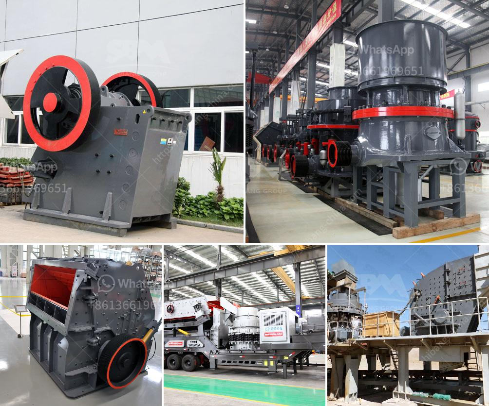

<h3>crushing products shanghai</h3>
Located in the bustling city of Shanghai, China, Crushing Products Shanghai is a reputable provider of crushing equipment, serving the mining industry for over two decades. Renowned for its high-quality products, superior technical expertise, and reliable customer service, Crushing Products Shanghai has made significant contributions to the advancement of the mining industry in China and worldwide.

Crushing Products Shanghai specializes in the production and distribution of various crushing machines, including jaw crushers, impact crushers, cone crushers, and mobile crushing stations. These state-of-the-art machines are designed to efficiently break down and process different types of ore, rocks, and minerals, ensuring the highest level of productivity and profitability for mining operations.

One of the key factors that sets Crushing Products Shanghai apart from its competitors is its strong commitment to innovation and technology. The company invests heavily in research and development, constantly striving to improve the performance and efficiency of its crushing products. By integrating cutting-edge technologies, such as computer-aided design, hydraulic systems, and advanced control systems, Crushing Products Shanghai delivers equipment that not only meets but exceeds the industry's stringent standards.

Moreover, Crushing Products Shanghai places a strong emphasis on quality control and product reliability. Every machine undergoes rigorous testing and inspections throughout the manufacturing process to ensure it meets the highest quality standards. The company also utilizes advanced manufacturing techniques and high-quality materials, resulting in robust and durable crushing equipment that can withstand even the most demanding mining environments.

In addition to its exceptional products, Crushing Products Shanghai prides itself on offering comprehensive after-sales support. The company has established a dedicated team of highly skilled technicians who provide prompt installation, maintenance, and repair services. This commitment to customer satisfaction has earned Crushing Products Shanghai a loyal clientele that spans across China and extends to numerous countries worldwide.

Crushing Products Shanghai's influence extends beyond its local market. As China has become a global leader in the mining industry, the company's products have gained international recognition and are sought after by mining companies worldwide. Crushing equipment from Shanghai is exported to countries across Asia, Africa, Europe, and the Americas, contributing to the development of mining operations on a global scale.

Furthermore, Crushing Products Shanghai actively participates in international mining exhibitions, conferences, and meetings, sharing its expertise with industry professionals and fostering global collaborations. By engaging in knowledge exchange and promoting technological advancements, the company helps shape the future of the mining industry.

Crushing Products Shanghai's commitment to sustainability is also worth noting. The company actively seeks eco-friendly solutions in its manufacturing processes, aiming to reduce waste generation and minimize its environmental footprint. By prioritizing sustainable practices, Crushing Products Shanghai demonstrates its responsibility towards preserving natural resources and protecting the environment for future generations.

In conclusion, Crushing Products Shanghai has emerged as a leading provider of crushing equipment, elevating the standards of the mining industry. With its focus on innovation, product quality, customer support, and sustainability, the company sets a benchmark for others to follow. As the demand for mining products continues to rise, Crushing Products Shanghai remains at the forefront, catering to the evolving needs of mining companies worldwide.
<h3>Contact us</h3><ul><li><strong>Whatsapp:&nbsp;<a href="https://wa.me/8613661969651">+8613661969651</a></strong></li><li><a href="https://swt.shibang-china.com/?git&amp;zhl&amp;crushing products shanghai"><strong>Online Service(chat now)</strong></a></li></ul><h3>Related</h3><ul><li><a href='used jaw crushers from oman.md'>used jaw crushers from oman</a></li><li><a href='machinery required to setup cement plant.md'>machinery required to setup cement plant</a></li><li><a href='kaolin mining india.md'>kaolin mining india</a></li><li><a href='lime and dolomite crusher plant.md'>lime and dolomite crusher plant</a></li><li><a href='stone crushers machine malaysia.md'>stone crushers machine malaysia</a></li></ul>