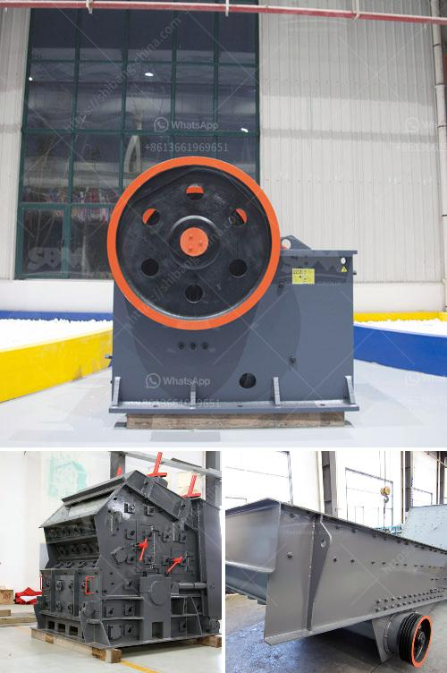

<h3>crushing rock aggregate machinery</h3>
Crushing rock aggregate is a vital process in the construction industry. Whether you're building roads, railways, or residential houses, you need high-quality materials to ensure the durability and strength of structures. To accomplish this, advanced machinery is used to crush and break down large rocks into smaller fragments known as aggregate.

One of the key machines used in this process is the rock crusher. It efficiently reduces large rocks into smaller, more manageable sizes for further processing. Typically, a rock crusher consists of a hopper, a cone or jaw crusher, and a vibrating screen. Different sizes of aggregate can be produced by adjusting the settings of the crusher to suit the specific requirements of the project.

The primary crusher, commonly a jaw crusher, is responsible for initial reduction. It applies force to break down the rocks and generate smaller pieces. These smaller sizes are then conveyed to the secondary crusher, typically a cone crusher, where further crushing occurs. The cone crusher ensures that the aggregate particles are consistent in shape and size.

In addition to crushers, other machinery such as conveyors, screens, and feeders play a crucial role in this process. They help transport and sort the aggregate material, ensuring that each particle is of the desired size and quality. These machines work together seamlessly to produce the required aggregate for construction projects.

Crushing rock aggregate machinery offers several benefits. Firstly, it helps to meet the demand for high-quality materials, ensuring the longevity and safety of structures. Additionally, using efficient machinery reduces the time and labor required for manual crushing. It also minimizes the environmental impact associated with extracting and processing raw materials.

In conclusion, the machinery used to crush rock aggregate plays a fundamental role in the construction industry. It enables the production of high-quality aggregate, necessary for building various infrastructure projects. By choosing the appropriate machinery and equipment, construction companies can ensure efficiency, durability, and environmental sustainability in their operations.
<h3>Contact us</h3><ul><li><strong>Whatsapp:&nbsp;<a href="https://wa.me/8613661969651">+8613661969651</a></strong></li><li><a href="https://swt.shibang-china.com/?git&amp;zhl&amp;crushing rock aggregate machinery"><strong>Online Service(chat now)</strong></a></li></ul><h3>Related</h3><ul><li><a href='sample gold processing and mining business plan pdf.md'>sample gold processing and mining business plan pdf</a></li><li><a href='how to make clay from powder clay.md'>how to make clay from powder clay</a></li><li><a href='used mine equipment price.md'>used mine equipment price</a></li><li><a href='second hand crusher to buy in zambia.md'>second hand crusher to buy in zambia</a></li><li><a href='saudi arabia used conveyor belts price.md'>saudi arabia used conveyor belts price</a></li></ul>