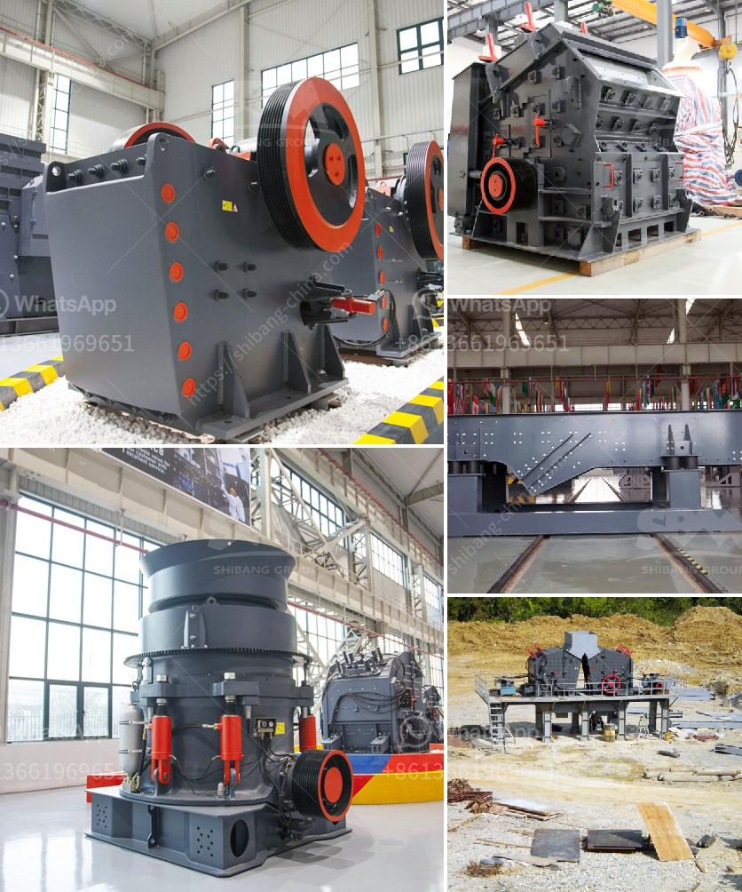

<h3>crushing stone crusher in spinal</h3>
Spinal stones, a medical condition characterized by the formation of hard deposits in the spinal canal, can cause excruciating pain and severe complications. While there are various treatment methods available, the advent of a groundbreaking medical device called the stone crusher has revolutionized the management of this condition. This article aims to shed light on the efficacy of the stone crusher in crushing spinal stones, highlighting its significant impact on patient outcomes and overall quality of life.

Spinal stones, also known as spinal calculi or spinal concretions, can develop in the spinal canal due to the crystallization of minerals or other substances. These stones can be the result of chronic infections, metabolic disorders, or degenerative processes within the spine. Once formed, they obstruct the spinal canal, leading to debilitating symptoms such as persistent pain, restricted mobility, and neurological complications.

Traditional treatment approaches for spinal stones involve a combination of medication, physiotherapy, and surgery. Medications are used to control pain and inflammation, while physiotherapy helps improve range of motion and relieve stiffness. However, these methods often provide only temporary relief, and surgical intervention may be necessary to remove the stones physically.

With the introduction of the stone crusher, a novel medical device that uses shock waves to crush spinal stones, the management of this condition has taken a giant leap forward. This non-invasive procedure, known as extracorporeal shock wave lithotripsy (ESWL), involves the application of high-intensity shock waves to pulverize spinal stones into smaller fragments. These fragments are then naturally eliminated from the body.

The stone crusher has garnered immense popularity due to its numerous advantages. Firstly, it eliminates the need for invasive surgeries, reducing the risks associated with anesthesia and surgical complications. Furthermore, the non-invasive nature of ESWL allows for a shorter recovery time, enabling patients to resume their daily activities quickly.

Moreover, the stone crusher provides precise targeting of spinal stones, ensuring minimal damage to surrounding tissue. The procedure is guided and monitored by advanced imaging techniques, such as fluoroscopy and ultrasound, guaranteeing precise stone fragmentation while preserving the integrity of the spinal canal.

The significant impact of the stone crusher in managing spinal stones is best reflected in the improved patient outcomes. Patients who have undergone ESWL using the stone crusher have reported a substantial reduction in pain, restoration of mobility, and improved overall quality of life. For many individuals, this revolutionary device has provided hope in their fight against this debilitating condition.

The stone crusher's groundbreaking technology has revolutionized the treatment of spinal stones, offering patients a minimally invasive and highly effective solution. By replacing invasive surgeries and providing precise targeting, this device has significantly improved patient outcomes, reducing pain and enhancing quality of life. As we move forward, continued advancements in stone crusher technology are expected to provide even better results, further solidifying its role in crushing spinal stones and extending hope to those affected by this silent killer.
<h3>Contact us</h3><ul><li><strong>Whatsapp:&nbsp;<a href="https://wa.me/8613661969651">+8613661969651</a></strong></li><li><a href="https://swt.shibang-china.com/?git&amp;zhl&amp;crushing stone crusher in spinal"><strong>Online Service(chat now)</strong></a></li></ul><h3>Related</h3><ul><li><a href='limestone quarry mining plant price.md'>limestone quarry mining plant price</a></li><li><a href='small stone crusher supplier in the philippines.md'>small stone crusher supplier in the philippines</a></li><li><a href='crawler mobile crushers.md'>crawler mobile crushers</a></li><li><a href='quarry plant for sale south africa.md'>quarry plant for sale south africa</a></li><li><a href='price of stone crushing machine in nigeria.md'>price of stone crushing machine in nigeria</a></li></ul>