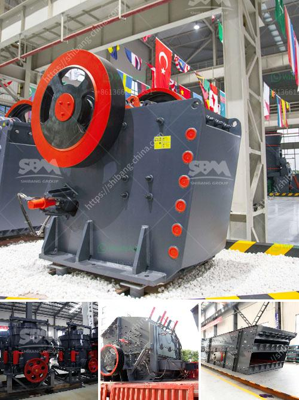

<h3>cyclone sand separator for sand mining</h3>
Sand mining is a significant industry that extracts sand for various purposes, such as construction, beach nourishment, and hydraulic fracturing. However, the extraction process often involves the use of large amounts of water, leading to the separation of sand particles and water. To address this challenge, the cyclone sand separator has emerged as an efficient solution.

Cyclone sand separators are devices that utilize centrifugal force to separate sand particles from water during the mining process. This technology works by creating a vortex-like motion that pushes water and sand towards the outer edge of the separator. Then, the sand particles, being denser, settle at the bottom, while the water escapes through the top.

One of the main advantages of using cyclone sand separators is their high efficiency in separating sand particles from water. These separators can remove a large amount of sand, ensuring that the water is clean and free from particles that can clog pipelines or cause damage to equipment. In addition, the cyclonic action of the separator prevents sand accumulation, reducing the need for maintenance and ensuring consistent performance.

Another benefit of using cyclone sand separators is their versatility. These devices can be used in various sand mining applications, including dredging, beach nourishment, and oil and gas operations. They can handle different types of sand, ranging from fine to coarse particles, making them suitable for a wide range of projects.

In terms of environmental sustainability, cyclone sand separators also offer significant advantages. By effectively separating sand particles, they help minimize the environmental impact of sand mining operations. Clean water can be returned to its natural habitat or reused in the mining process, reducing the need for fresh water intake and conserving this valuable resource.

Overall, the cyclone sand separator is proving to be a valuable tool in the sand mining industry. With its high efficiency, versatility, and positive environmental impact, it provides an efficient solution for separating sand particles from water during the extraction process. This technology not only enhances the productivity of sand mining operations but also promotes sustainability by reducing water consumption and minimizing the environmental impact.
<h3>Contact us</h3><ul><li><strong>Whatsapp:&nbsp;<a href="https://wa.me/8613661969651">+8613661969651</a></strong></li><li><a href="https://swt.shibang-china.com/?git&amp;zhl&amp;cyclone sand separator for sand mining"><strong>Online Service(chat now)</strong></a></li></ul><h3>Related</h3><ul><li><a href='sand crusher machine.md'>sand crusher machine</a></li><li><a href='smallest cement plant.md'>smallest cement plant</a></li><li><a href='crusher plant price pakistan.md'>crusher plant price pakistan</a></li><li><a href='hot used trommel screen machine in sand.md'>hot used trommel screen machine in sand</a></li><li><a href='concrete crusher price philippines.md'>concrete crusher price philippines</a></li></ul>