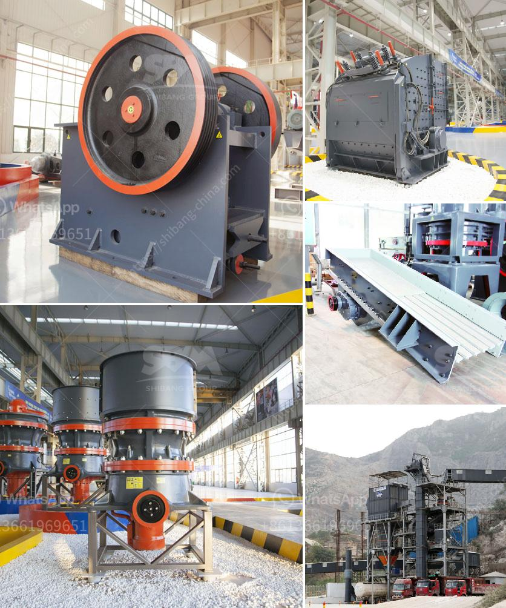

<h3>demand and supply of stone ballast in kenya</h3>
Stone ballast is a crucial element in the construction and maintenance of railway tracks. These rough stones serve as the foundation for the railway sleepers, securing them in place and preventing any movement caused by passing trains. Over time, the demand for this essential construction material has increased in Kenya, as the country continues to invest in expanding and upgrading its rail infrastructure.

The demand for stone ballast in Kenya has been growing due to various factors. Firstly, the ongoing railway projects in the country have generated a significant need for this material. The construction of the Standard Gauge Railway (SGR) is one such project that has contributed to the surge in demand. The SGR initiative aims to connect major economic hubs in Kenya, such as Nairobi, Mombasa, and Kisumu, through a modern and efficient rail network. To ensure the stability and longevity of these massive infrastructure projects, an abundant supply of stone ballast is necessary.

Secondly, the maintenance and repair of existing railway lines also require a steady supply of stone ballast. As train traffic and loads increase, the tracks gradually wear out and become uneven. Adding fresh ballast helps restore the tracks to their original level and makes them durable for enhanced train operations. Neglecting this maintenance can lead to accidents, derailments, and disruptions in the railway transport system.

However, the supply of stone ballast in Kenya has not been able to meet the growing demand. One of the main reasons for this imbalance is the lack of proper stone quarries in the country. Quarrying involves the extraction of stones from large natural deposits, which are then crushed and screened to produce ballast. Unfortunately, Kenya has limited quarrying sites compared to the increasing demand, resulting in insufficient supply.

Furthermore, the transportation of stone ballast poses a challenge, contributing to the supply constraint. The available quarries are often located far from the areas where the demand is highest, requiring long-distance transportation. This transportation issue not only escalates the cost of stone ballast but also increases logistical complexities, making it harder for suppliers to meet the demand promptly.

The inadequate supply of stone ballast in Kenya has led to multiple consequences. Firstly, the price of this construction material has skyrocketed due to the lack of competition in the market. Contractors and railway companies often have to pay exorbitant charges for stone ballast to complete their projects. Secondly, the delays in acquiring adequate supplies have resulted in project delays and disruptions. This has a ripple effect on the overall construction industry and the economy, as infrastructure development is a key driver of economic growth.

To address the supply-demand gap for stone ballast in Kenya, the government and relevant authorities must take proactive measures. Identifying and establishing new quarrying sites could help increase the production capacity of stone ballast. Streamlining the logistics and transportation processes can also reduce the costs and time associated with delivering the material to the required destinations.

Moreover, diversification of the supply chain is crucial. Seeking alternatives to natural stone, such as recycled materials or synthetic substitutes, could help ease the pressure on natural resources and align the supply with the demand. Additionally, encouraging private investments in quarrying and stone ballast production can inject competition into the market, leading to fairer prices and more efficient supply.

In conclusion, the demand for stone ballast in Kenya is driven by railway construction and maintenance projects. However, insufficient quarrying sites and transportation challenges have resulted in a supply-demand imbalance. This has led to the increased cost of stone ballast, project delays, and disruptions in the construction industry. Addressing these challenges through the identification of new quarrying sites, streamlining transportation, and exploring alternative materials is crucial to meet the demand for stone ballast and support Kenya's infrastructure development.
<h3>Contact us</h3><ul><li><strong>Whatsapp:&nbsp;<a href="https://wa.me/8613661969651">+8613661969651</a></strong></li><li><a href="https://swt.shibang-china.com/?git&amp;zhl&amp;demand and supply of stone ballast in kenya"><strong>Online Service(chat now)</strong></a></li></ul><h3>Related</h3><ul><li><a href='impact crusher for sale in saudi arabia.md'>impact crusher for sale in saudi arabia</a></li><li><a href='how to build a concrete crusher.md'>how to build a concrete crusher</a></li><li><a href='equipment equipment for mineral crushing.md'>equipment equipment for mineral crushing</a></li><li><a href='copper processing machine.md'>copper processing machine</a></li><li><a href='jaw crusher for sale in saudi.md'>jaw crusher for sale in saudi</a></li></ul>