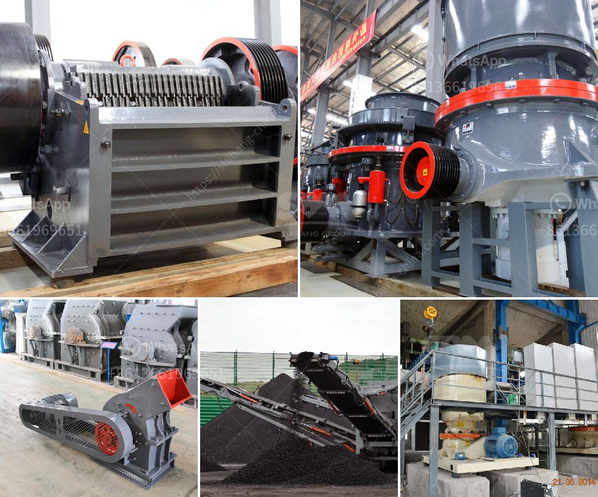

<h3>desain conveyor belt di tambang batu bara</h3>
Conveyor belts are a crucial component in the mining industry, especially in coal mining operations. These belts are responsible for transporting large quantities of coal from the mining area to the processing plants and storage yards. Without a reliable conveyor belt system, it would be challenging to efficiently move and manage coal in the mining industry.

Desain conveyor belts di tambang batu bara, or the design of conveyor belts in coal mines, is of utmost importance. The design of these belts must take into consideration various factors such as load capacity, belt speed, material characteristics, and the mining environment.

One essential aspect that designers focus on is the load capacity of the conveyor belt. This refers to the maximum weight the belt can handle without experiencing excessive strain or breakage. With the high volumes of coal being transported in the mining industry, it is crucial to ensure that the conveyor belts have sufficient load capacity to handle the workload effectively.

Another crucial factor is the belt speed, which determines the efficiency of the coal transportation process. A carefully designed conveyor belt should have an optimal speed that allows for a smooth and continuous flow of coal from one point to another.

Material characteristics, such as the size and moisture content of the coal, also play a significant role in the design process. The conveyor belt must be durable enough to withstand the abrasive nature of coal and the potential impact caused by larger particles. Additionally, the belt must be resistant to moisture to prevent deterioration and prolong its lifespan.

Lastly, the mining environment introduces specific challenges that must be considered in the design of conveyor belts. The belts must be able to withstand extreme temperatures, dust, and other contaminants that are common in mining operations. Furthermore, the belts must be equipped with safety features to prevent accidents and injuries, such as emergency stop switches and guardrails.

In conclusion, the desain conveyor belt di tambang batu bara is vital for the successful and efficient operation of the coal mining industry. With careful consideration of factors such as load capacity, belt speed, material characteristics, and the mining environment, designers can create conveyor belt systems that can withstand the harsh conditions and ensure the uninterrupted flow of coal.
<h3>Contact us</h3><ul><li><strong>Whatsapp:&nbsp;<a href="https://wa.me/8613661969651">+8613661969651</a></strong></li><li><a href="https://swt.shibang-china.com/?git&amp;zhl&amp;desain conveyor belt di tambang batu bara"><strong>Online Service(chat now)</strong></a></li></ul><h3>Related</h3><ul><li><a href='europe used grinding equipment.md'>europe used grinding equipment</a></li><li><a href='limestone powder making process.md'>limestone powder making process</a></li><li><a href='gold mining price.md'>gold mining price</a></li><li><a href='copper mining in zambia.md'>copper mining in zambia</a></li><li><a href='stone crusher to diessel.md'>stone crusher to diessel</a></li></ul>