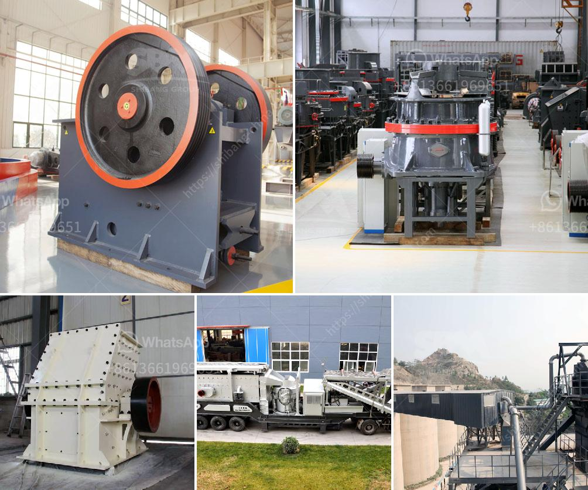

<h3>desain gambar vibrating screen 100ton jam</h3>
Vibrating screens have been widely used in industrial and mining applications to separate and size different materials. The design of these screens is critical, as they tend to endure heavy usage and require efficient operation for maximum productivity. One particular challenge is designing a vibrating screen that achieves the desired tonnage per hour while maintaining high efficiency.

One key consideration in designing a vibrating screen is the desired throughput. This refers to the amount of material that can be processed in a given time frame. For instance, a vibrating screen with a throughput of 100 tons per hour may prove inefficient if it cannot handle the required capacity. In contrast, a vibrating screen with a higher throughput, such as 300 tons per hour, may result in a lower overall efficiency if the design is not optimized.

To address these concerns, designers consider several factors during the design process. Firstly, the type and size of the material being processed play a crucial role. It is essential to understand the characteristics of the material, such as its particle size distribution and moisture content. This information helps determine the appropriate screen size, type of mesh, and inclination angle, among other factors.

Another aspect to consider is the design of the vibrating screen itself. Structural integrity is a priority to ensure the screen can withstand the load and vibrations generated during operation. Reinforcing bars and cross bracing in the design can enhance stability and prolong the screen's lifespan.

Furthermore, the motor power and drive system should be selected carefully to match the desired throughput. A properly sized motor will prevent premature wear and tear, ensuring consistent performance. Additionally, the drive system should be robust enough to handle the load and minimize any unwanted vibrations.

In conclusion, designing a vibrating screen with a throughput of 100 tons per hour requires careful consideration of several factors. Understanding the material being processed and its characteristics is crucial, as it determines the appropriate screen size, type of mesh, and inclination angle. Additionally, reinforcing the structure and selecting the appropriate motor power and drive system contribute to a more efficient and long-lasting vibrating screen. With meticulous design and engineering, a vibrating screen can deliver the desired tonnage per hour, resulting in optimized operations.
<h3>Contact us</h3><ul><li><strong>Whatsapp:&nbsp;<a href="https://wa.me/8613661969651">+8613661969651</a></strong></li><li><a href="https://swt.shibang-china.com/?git&amp;zhl&amp;desain gambar vibrating screen 100ton jam"><strong>Online Service(chat now)</strong></a></li></ul><h3>Related</h3><ul><li><a href='concrete waste crushing and iron.md'>concrete waste crushing and iron</a></li><li><a href='coal milling machine.md'>coal milling machine</a></li><li><a href='enquiry about impact crusher.md'>enquiry about impact crusher</a></li><li><a href='capacity of the ball mill and rod mill.md'>capacity of the ball mill and rod mill</a></li><li><a href='stamp mill for sale in zimbabwe.md'>stamp mill for sale in zimbabwe</a></li></ul>