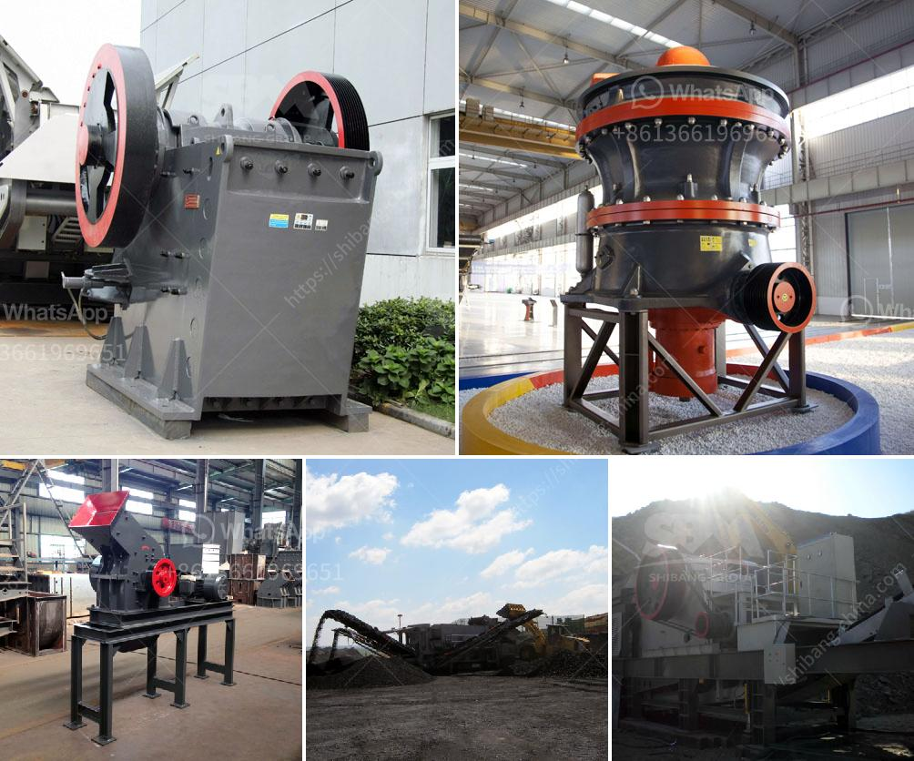

<h3>design of gravel screening and washing plant</h3>
When it comes to designing a gravel screening and washing plant, there are several factors to consider. These include the type of gravel, the desired particle size range, and the available space among others. By carefully considering these factors, you can create a plant that efficiently screens and washes gravel, producing high-quality materials. In this article, we will discuss some tips and considerations to keep in mind during the design process.

First and foremost, it is important to determine the type of gravel that will be processed in the plant. Gravel can vary in size and composition, with different types requiring different processing techniques. For example, rounded river gravel may not need as much screening compared to angular crushed gravel. Understanding the characteristics of the gravel will help determine the appropriate equipment to include in the plant.

Next, the desired particle size range should be established. This will depend on the specific applications for which the gravel will be used. Some projects may require a specific mix of coarse and fine gravel particles, while others may have strict size limitations. By understanding the desired particle size range, you can tailor the screening and washing processes to meet these requirements.

In addition to size, the plant's production capacity should also be considered. This will depend on factors such as the available raw material, the processing rate, and the volume of finished product required. It is important to design the plant with a capacity that can meet the demand, while also allowing for future growth or expansion if needed.

Another important consideration is the available space for the plant. Gravel screening and washing plants can vary in size, ranging from compact mobile plants to large stationary installations. The available space will dictate the type and configuration of equipment that can be used. For example, if space is limited, a mobile plant may be more suitable, while a stationary plant can accommodate larger equipment and may offer higher production capacity.

When it comes to equipment selection, there are several key components to consider. These include screens, crushers, and washers. Screens are used to separate the gravel into different sizes, while crushers can be used to break down larger pieces of material. Washers are essential for removing clay, silt, and other impurities from the gravel. Choosing the right equipment and configuring them properly will ensure efficient and effective processing.

Lastly, it is important to consider the overall plant layout and flow of material. A well-designed layout will optimize the flow of material through the plant, minimizing handling and maximizing efficiency. This includes carefully positioning equipment, considering the location of stockpiles, and planning the flow of material through different stages of processing.

In conclusion, designing a gravel screening and washing plant requires careful consideration of factors such as the type of gravel, desired particle size range, production capacity, available space, and equipment selection. By taking these factors into account, you can create a plant that efficiently processes gravel, producing high-quality materials for various applications.
<h3>Contact us</h3><ul><li><strong>Whatsapp:&nbsp;<a href="https://wa.me/8613661969651">+8613661969651</a></strong></li><li><a href="https://swt.shibang-china.com/?git&amp;zhl&amp;design of gravel screening and washing plant"><strong>Online Service(chat now)</strong></a></li></ul><h3>Related</h3><ul><li><a href='metal crusher machine for rent in sri lanka.md'>metal crusher machine for rent in sri lanka</a></li><li><a href='gypsum fertilizer granulator for sale.md'>gypsum fertilizer granulator for sale</a></li><li><a href='quarry crusher manufacturer.md'>quarry crusher manufacturer</a></li><li><a href='hp cone crusher device.md'>hp cone crusher device</a></li><li><a href='stone crusher ethiopia.md'>stone crusher ethiopia</a></li></ul>