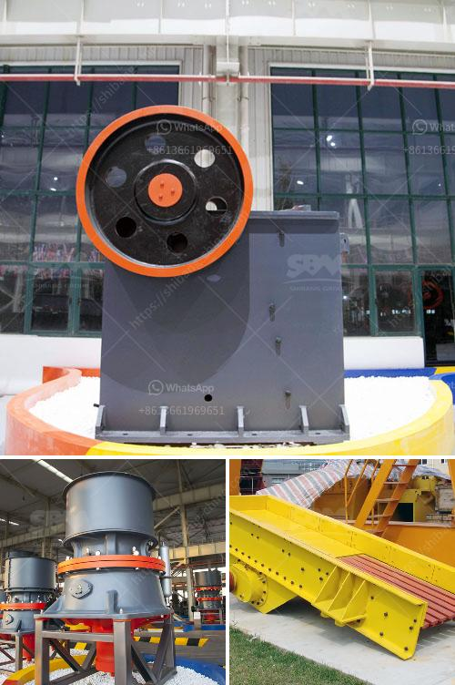

<h3>diagram of a typical hammer mill</h3>
A hammer mill is a machine used for grinding materials into smaller pieces, usually by impact. It consists of a series of hammers mounted on a rotating shaft. This diagrammatic representation illustrates a typical hammer mill configuration.

1. Particle size reduction mechanism: Initially, the material enters the grinding chamber from the top, where it is initially impacted by the hammers. The rotational movement of the hammers creates a series of impact forces that reduce the size of the particles.

2. Hammer assembly: The hammers are connected to the rotor shaft and are made of materials such as steel or stainless steel. They are designed to be durable and capable of withstanding the impact forces generated during the grinding process.

3. Rotor: The rotor is the main rotating component of the hammer mill. It consists of a central shaft with several hammers attached to it. The rotation of the rotor causes the hammers to swing outwards, impacting the material and reducing its size.

4. Screen: The crushed particles pass through a perforated screen located at the bottom of the grinding chamber. The size of the screen determines the final particle size of the ground material. Smaller particles can pass through the screen, while larger particles are retained and further reduced in size.

5. Inlet and outlet: The material to be ground enters the hammer mill through the inlet, while the ground material exits through the outlet. The inlet and outlet can be adjusted to control the flow rate and discharge of the material.

6. Motor: The hammer mill is powered by an electric or diesel motor, which provides the necessary rotational power to drive the rotor and hammers.

7. Control panel: A control panel is incorporated into the hammer mill to adjust various parameters such as the rotational speed, flow rate, and particle size. This allows for precise control over the grinding process and ensures the desired end product is achieved.

8. Dust collection system: To prevent the escape of dust particles during operation, a dust collection system is often installed in the hammer mill. This system captures the dust generated during grinding, preventing it from entering the surrounding environment.

In summary, a typical hammer mill consists of hammers, a rotating shaft, a screen, an inlet and outlet, a motor, a control panel, and a dust collection system. This diagrammatic representation provides a clear understanding of the working principle and components of a hammer mill, highlighting its role in particle size reduction and grinding processes.
<h3>Contact us</h3><ul><li><strong>Whatsapp:&nbsp;<a href="https://wa.me/8613661969651">+8613661969651</a></strong></li><li><a href="https://swt.shibang-china.com/?git&amp;zhl&amp;diagram of a typical hammer mill"><strong>Online Service(chat now)</strong></a></li></ul><h3>Related</h3><ul><li><a href='equipment for limestone mine.md'>equipment for limestone mine</a></li><li><a href='coal crushing plant.md'>coal crushing plant</a></li><li><a href='ball mill manufacturer india.md'>ball mill manufacturer india</a></li><li><a href='coal crusher specification pdf.md'>coal crusher specification pdf</a></li><li><a href='china quarry crusher equipment.md'>china quarry crusher equipment</a></li></ul>