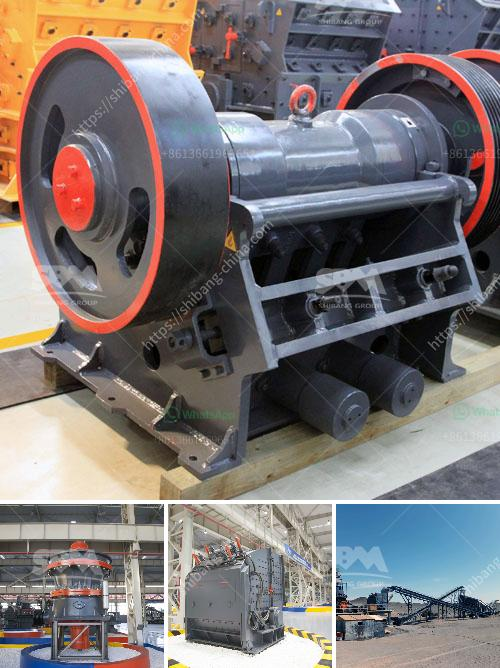

<h3>diameter of the ball mill</h3>
The diameter of the ball mill plays a crucial role in the optimal operation of the equipment. The optimal diameter can provide an efficient grinding process, ensure maximum output, and reduce energy consumption.

Therefore, understanding the size and design specifications of the ball mill is essential for achieving the desired results. However, if your equipment is not equipped with the optimal diameter, it may lead to inadequate grinding performance and low efficiency.

To begin with, the diameter of the ball mill is calculated to determine the size of the grinding medium. You need to take into account the feed size, mill speed, ball diameter, and ball-to-powder ratio used in the grinding process. Factors such as the material properties, milling time, and grinding environment should also be considered.

When determining the diameter, the feed size is crucial as it determines the size of the feed material that can be effectively processed in the ball mill. The feed size should be below the critical speed for efficient grinding. If the feed size is too large, it may lead to overloading of the mill, resulting in decreased efficiency and increased energy consumption.

The mill speed is another critical factor that affects the diameter of the ball mill. It determines the velocity at which the grinding media cascade, impacting the material and promoting grinding. Higher mill speeds usually result in finer grinding and higher energy consumption. Therefore, the mill speed should be optimized to achieve the desired grinding performance.

Furthermore, the ball diameter also plays a significant role in the grinding process. It determines the contact surface area between the grinding media and the material, affecting the grinding efficiency. A larger ball diameter means a higher material impact and grinding force, which can result in higher grinding efficiency. However, a larger ball diameter also requires a higher energy input, leading to increased energy consumption.

The ball-to-powder ratio is another factor that determines the optimal ball mill diameter. It refers to the weight ratio of the grinding balls to the powder material. A higher ball-to-powder ratio results in more grinding balls, leading to increased impacts and grinding forces. This can enhance the grinding efficiency of the ball mill. However, a higher ball-to-powder ratio also requires more energy input, leading to higher energy consumption.

Finally, the material properties, milling time, and grinding environment should also be considered when determining the optimal ball mill diameter. Some materials are more difficult to grind, requiring a smaller ball mill diameter to achieve the desired grinding fineness. The milling time and grinding environment, such as the presence of liquid additives or corrosive media, can also affect the optimal ball mill diameter.

In conclusion, the diameter of the ball mill plays a crucial role in achieving optimal grinding performance. It is determined by various factors, including the feed size, mill speed, ball diameter, and ball-to-powder ratio. Understanding these factors and selecting the appropriate ball mill diameter can result in efficient grinding, maximum output, and reduced energy consumption.
<h3>Contact us</h3><ul><li><strong>Whatsapp:&nbsp;<a href="https://wa.me/8613661969651">+8613661969651</a></strong></li><li><a href="https://swt.shibang-china.com/?git&amp;zhl&amp;diameter of the ball mill"><strong>Online Service(chat now)</strong></a></li></ul><h3>Related</h3><ul><li><a href='quarry crusher business in south africa.md'>quarry crusher business in south africa</a></li><li><a href='cost of setting up a quarry crusher plant.md'>cost of setting up a quarry crusher plant</a></li><li><a href='quartz powder making machinery.md'>quartz powder making machinery</a></li><li><a href='diagram of a typical hammer mill.md'>diagram of a typical hammer mill</a></li><li><a href='complete stone crushing plant.md'>complete stone crushing plant</a></li></ul>