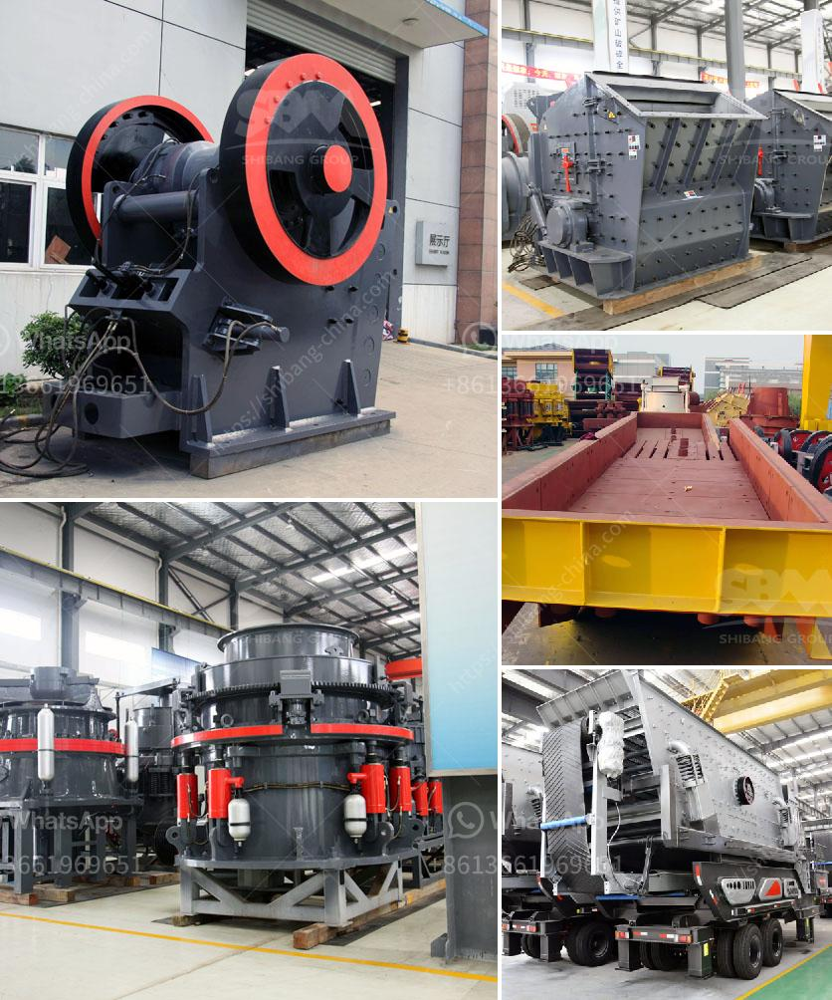

<h3>diamond mining machine in south africa</h3>
Diamond mining in South Africa has a rich and complex history. With numerous diamond reserves spread across the country, it has become one of the top producers of high-quality diamonds globally. To extract these precious gems, sophisticated diamond mining machines are used, ensuring efficiency and safety in the mining process.

One of the most important machines used in diamond mining is the excavator. This massive machine, equipped with a hydraulic system and a bucket, is used to dig deep into the earth's surface to unearth diamonds. The excavator's robust design enables it to handle the harsh conditions of the mining environment, from rocky terrains to sandy soils.

Once the diamonds are extracted, they are transported to the sorting facility, where diamond mining machines such as X-ray machines and electromagnetic separators come into play. X-ray machines are particularly effective in identifying diamonds as they can distinguish the unique atomic structure of a diamond from other minerals. Electromagnetic separators are used to separate diamonds from other non-magnetic materials, ensuring the purity and quality of the final product.

Another crucial machine in diamond mining is the diamond processing plant, where the extracted diamonds undergo various processes to transform them into market-ready gems. These processes include cutting, shaping, and polishing to enhance the brilliance and clarity of the diamonds. Diamond processing machines, such as laser cutting machines and automated polishing machines, are used to achieve precision and consistency in the diamond-cutting process.

Mining companies in South Africa continuously invest in modernizing their diamond mining machines to increase productivity and reduce the environmental impact. These machines incorporate advanced technologies, ensuring optimal resource utilization and minimal material wastage.

Despite the advancements in technology, it is important to note that diamond mining still poses significant environmental challenges. Mining sites need to implement stringent measures to mitigate soil erosion, deforestation, and water pollution. Sustainable mining practices such as land rehabilitation and water management are of utmost importance to ensure the long-term viability of diamond mining in South Africa.

In conclusion, diamond mining machines play a crucial role in the extraction, sorting, and processing of diamonds in South Africa. These machines not only enable efficient and safe mining operations but also contribute to the country's economy and global diamond supply. The mining industry must continue to balance its economic interests with sustainable practices to ensure responsible and ethical diamond mining in South Africa.
<h3>Contact us</h3><ul><li><strong>Whatsapp:&nbsp;<a href="https://wa.me/8613661969651">+8613661969651</a></strong></li><li><a href="https://swt.shibang-china.com/?git&amp;zhl&amp;diamond mining machine in south africa"><strong>Online Service(chat now)</strong></a></li></ul><h3>Related</h3><ul><li><a href='cone crusher in america.md'>cone crusher in america</a></li><li><a href='coal crushing plant.md'>coal crushing plant</a></li><li><a href='vibro screen machine in ahmedabad.md'>vibro screen machine in ahmedabad</a></li><li><a href='magnetic separator equipment for sale.md'>magnetic separator equipment for sale</a></li><li><a href='best portable jaw crusher granite.md'>best portable jaw crusher granite</a></li></ul>