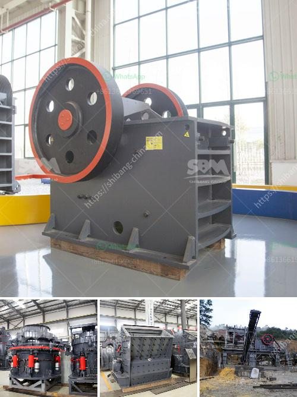

<h3>diamond mining machinery prices</h3>
Diamond mining is a highly lucrative industry, attracting both large corporations and individual miners from all corners of the world. While the labor-intensive process of diamond extraction remains largely unchanged, the machinery used in this field has evolved significantly over the years. These advanced machines have not only improved the efficiency of the mining process but also increased the quality and quantity of diamonds extracted. However, the prices of such machinery vary depending on various factors.

One of the primary factors impacting diamond mining machinery prices is the technology and features integrated into the equipment. Modern machinery incorporates cutting-edge technologies like automation, advanced sensors, and artificial intelligence, enabling miners to dig deeper and extract diamonds with precision. These machines are highly efficient and can significantly reduce the timeline required to extract diamonds, leading to increased profitability. Consequently, machinery equipped with the latest technologies tends to have higher price tags due to the significant investments made in research and development.

Another key determinant of diamond mining machinery prices is the size and capacity of the equipment. Larger machines with higher capacity are capable of processing more material in a shorter time. This translates into increased diamond production, which directly impacts profitability. However, such machinery requires substantial initial investments, leading to higher prices. Additionally, larger machines often require specialized transportation and maintenance, further adding to the overall cost.

Additionally, the condition and age of the machinery can also affect its pricing. Like any other machinery, diamond mining equipment depreciates over time. Older machines may lack the cutting-edge features found in newer models, which can result in decreased efficiency. However, some miners, particularly individuals or small-scale operations, may opt for used or refurbished machinery due to budget constraints. Such machines are available at a lower price point but may require additional maintenance and repairs.

Furthermore, the geographical location and regulations of the mining site can influence diamond mining machinery prices. In remote areas with limited infrastructure, transporting heavy equipment can be a challenging and expensive task. Therefore, machinery prices might include additional fees related to transportation, taxes, and import or export duties. At the same time, adherence to local regulations may require specific modifications or certifications, further affecting the overall price.

It is essential for potential buyers to consider all these factors before investing in diamond mining machinery. Evaluating the technological requirements, production capacity, maintenance cost, and transportation logistics can help determine the most suitable equipment for their mining operations. Additionally, thorough research and understanding of local regulations and legalities can help avoid unforeseen expenses and complications.

Overall, diamond mining machinery prices can vary significantly depending on factors such as technology, size, condition, and location. By carefully considering these elements, miners can make informed decisions and select equipment that maximizes their productivity and profitability in the dynamic and highly competitive diamond mining industry.
<h3>Contact us</h3><ul><li><strong>Whatsapp:&nbsp;<a href="https://wa.me/8613661969651">+8613661969651</a></strong></li><li><a href="https://swt.shibang-china.com/?git&amp;zhl&amp;diamond mining machinery prices"><strong>Online Service(chat now)</strong></a></li></ul><h3>Related</h3><ul><li><a href='business plan of silica sand crusher factory.md'>business plan of silica sand crusher factory</a></li><li><a href='gypsum powder production process.md'>gypsum powder production process</a></li><li><a href='crusher factory in kenya.md'>crusher factory in kenya</a></li><li><a href='industrial grinder fine powder.md'>industrial grinder fine powder</a></li><li><a href='flow chart of three stage agreegate crushing plant.md'>flow chart of three stage agreegate crushing plant</a></li></ul>