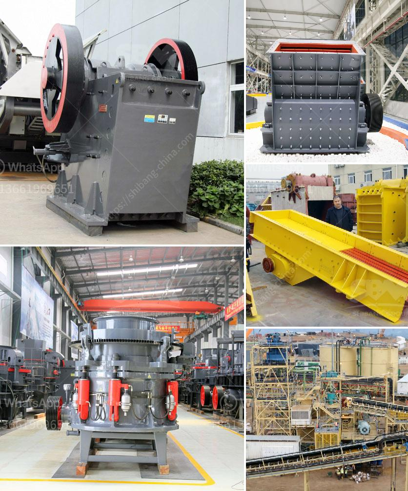

<h3>dicalcium phosphate process hydrochloric acid flow chart</h3>
Dicalcium phosphate (DCP) is a compound formed when a calcium source reacts with phosphoric acid. It is commonly used as a food additive and nutritional supplement due to its high calcium and phosphorus content. The production process of DCP involves the reaction of hydrochloric acid (HCl) with calcium carbonate (CaCO3) or calcium hydroxide (Ca(OH)2). In this article, we will explore the process of DCP production using hydrochloric acid and provide a flow chart to depict the various steps involved.

The production of DCP using hydrochloric acid starts with the preparation of the calcium source, which can be either calcium carbonate or calcium hydroxide. If calcium carbonate is used, it is first finely ground to enhance the reaction rate. On the other hand, if calcium hydroxide is employed, it is usually in the form of a slurry.

Once the calcium source is prepared, it is then blended with an adequate amount of hydrochloric acid in a reactor. The blending is done under controlled conditions to maintain the appropriate temperature and ensure efficient mixing. The reaction between hydrochloric acid and calcium carbonate or calcium hydroxide results in the formation of calcium chloride and phosphoric acid:

Next, the resulting mixture undergoes a filtration process to separate the solid calcium chloride from the liquid phosphoric acid solution. The filtration process typically utilizes a filter press or any other suitable filtration equipment. This step is crucial as it allows the separation of the desired product from any impurities or by-products.

The obtained phosphoric acid solution is then subjected to a purification step to remove any remaining impurities. This purification process may involve techniques such as precipitation, ion exchange, or solvent extraction. The purified phosphoric acid solution is then concentrated to the desired strength.

In the final step, the concentrated phosphoric acid solution undergoes a reaction with additional calcium carbonate or calcium hydroxide. This reaction yields dicalcium phosphate, which is then separated from the remaining solution through filtration. The obtained DCP is further dried and processed into the desired form, such as powder or granules, for commercial use.

3. Reaction between calcium source and hydrochloric acid, forming calcium chloride and phosphoric acid

7. Reaction between concentrated phosphoric acid solution and additional calcium carbonate or calcium hydroxide, forming dicalcium phosphate

In conclusion, the production of dicalcium phosphate using hydrochloric acid involves various steps, from the preparation of the calcium source to the final drying and processing of the DCP. The flow chart provided outlines the sequence of these steps, providing a comprehensive understanding of the process. This allows for the efficient and controlled production of DCP with hydrochloric acid, ensuring the quality and purity of the final product.
<h3>Contact us</h3><ul><li><strong>Whatsapp:&nbsp;<a href="https://wa.me/8613661969651">+8613661969651</a></strong></li><li><a href="https://swt.shibang-china.com/?git&amp;zhl&amp;dicalcium phosphate process hydrochloric acid flow chart"><strong>Online Service(chat now)</strong></a></li></ul><h3>Related</h3><ul><li><a href='mobile crusher price algerie.md'>mobile crusher price algerie</a></li><li><a href='ton per hour gold wash plants.md'>ton per hour gold wash plants</a></li><li><a href='ball mill of small size.md'>ball mill of small size</a></li><li><a href='mobile crusher ghana.md'>mobile crusher ghana</a></li><li><a href='technical parametres of impact crusher.md'>technical parametres of impact crusher</a></li></ul>