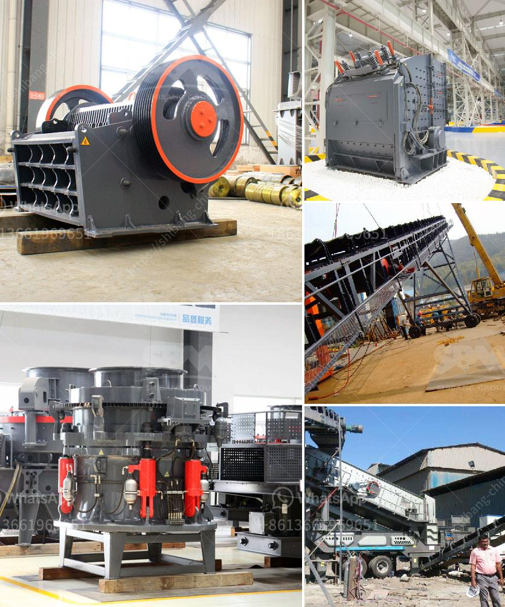

<h3>difference between milling and grinding</h3>
Milling and grinding are two common machining processes performed in the manufacturing industry. They both involve the removal of material from a workpiece, and they both utilize cutting tools to achieve this goal. However, their method of operation and the results they produce are quite different. In this article, we will explore the differences between milling and grinding in detail.

Milling is a machining process that uses a rotating cutter to remove material from a workpiece. The cutter is advanced along multiple axes to create various shapes, holes, and slots. It is commonly used for producing flat surfaces, gear teeth, and grooves.

One of the key advantages of milling is its versatility. With the right cutting tools and machining setup, milling machines can produce a wide range of complex shapes. Furthermore, milling can be performed on various types of materials, including metals, plastics, and composites.

Milling can be classified into two main types: peripheral and face milling. Peripheral milling involves the cutting tool moving along the periphery or outer surface of the workpiece, while face milling involves cutting along the flat, horizontal surface of the workpiece. Each type has its specific applications and benefits.

On the other hand, grinding is a precision machining process that uses a rotating abrasive wheel to remove material from a workpiece. Grinding is commonly used in the production of bearings, valves, and gears, as well as in precision engineering applications. It is also used for sharpening various cutting tools, such as drill bits and end mills.

Unlike milling, grinding is typically used to achieve a fine surface finish and high dimensional accuracy. Grinding is often the final step in the manufacturing process, as it can produce parts with tight tolerances and excellent surface quality. Moreover, it can be used to improve the mechanical properties of a workpiece, such as hardness and wear resistance.

Grinding can be classified into three main categories: surface grinding, cylindrical grinding, and internal grinding. Surface grinding is used to produce flat, parallel, and smooth surfaces, while cylindrical grinding is used to shape cylindrical or tapered workpieces. Internal grinding, as the name suggests, is used to grind the internal surfaces of a workpiece.

In terms of setup and equipment, milling machines and grinding machines share some similarities. Both types of machines require a workholding device, such as a vice or chuck, to hold the workpiece in place. However, milling machines usually have more axes and larger cutting tools, which require a sturdier machine structure and higher power consumption.

In conclusion, milling and grinding are two machining processes used in the manufacturing industry to remove material from a workpiece. They differ in their method of operation, the types of shapes they can produce, and the final results they achieve. While milling is more versatile and can produce a wider range of shapes, grinding excels in achieving precise dimensions and fine surface finish. Both processes have their specific applications and merits, and choosing between them depends on the desired outcome and the characteristics of the workpiece.
<h3>Contact us</h3><ul><li><strong>Whatsapp:&nbsp;<a href="https://wa.me/8613661969651">+8613661969651</a></strong></li><li><a href="https://swt.shibang-china.com/?git&amp;zhl&amp;difference between milling and grinding"><strong>Online Service(chat now)</strong></a></li></ul><h3>Related</h3><ul><li><a href='dicalcium phosphate process hydrochloric acid flow chart.md'>dicalcium phosphate process hydrochloric acid flow chart</a></li><li><a href='bauxite production line.md'>bauxite production line</a></li><li><a href='small concrete crusher used.md'>small concrete crusher used</a></li><li><a href='recycled concrete manufacturers in shanghai.md'>recycled concrete manufacturers in shanghai</a></li><li><a href='crushing equipment manufacturers.md'>crushing equipment manufacturers</a></li></ul>