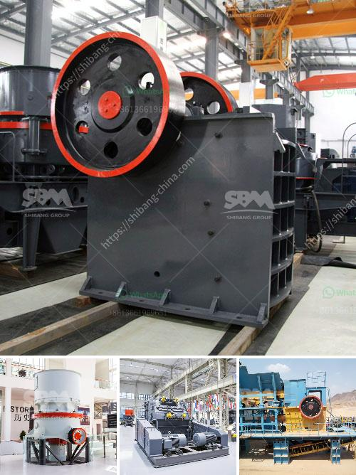

<h3>differences between hammer mill and ball mill</h3>
Hammer mill and ball mill are two common types of grinding equipment used in the mining and construction industries. Both are essential pieces of equipment that have their own set of differences and similarities.

Hammer mill is a high-speed machine that utilizes hammers and other repetitive impactors to crush materials into smaller pieces. It can be used for a variety of applications, including grain milling, ethanol production, and shredding scrap metal. The grinding process of a hammer mill involves collision between the fast-moving hammers and the materials being crushed.

On the other hand, ball mill is a horizontal cylinder that moves at a low speed and up to a certain height, creating very little sheer force. It utilizes a spinning motion to grind materials, such as coal, cement, and ore. The grinding process in a ball mill involves impact and attrition between the balls, grinding media, and the raw material being ground.

One major difference between ball mill and hammer mill is their respective working principles. Hammer mill mainly relies on the impact of the hammer to achieve material crushing. During the operation, the rotor rotates at a high speed, and the hammer effectively hits the feed material to generate coarse-to-fine particles. On the other hand, ball mill works on the principle of impact and attrition: the impact of the falling balls and the attrition between the balls and the material being ground.

Another significant difference between these two types of mills is their operating speed. Hammer mills are typically designed to operate at very high speeds, ranging from 2000 to 6000 RPM. This high speed enables the hammers to shatter rocks or other abrasive materials providing a faster and more efficient grinding process. Conversely, ball mills are designed to operate at a lower speed, generally ranging from 60 to 75 percent of critical speed. This slower rotation speed leads to a more refined grinding process, resulting in a finer particle size distribution.

Additionally, the size of the grinding media in a ball mill is much smaller than that of a hammer mill. The small size of the balls enables them to move swiftly along with the rotation of the mill, thereby grinding the material through pressure and impact. In contrast, the large hammers in a hammer mill obstruct the free flow of material and break it by impact, resulting in a broader particle size distribution.

Furthermore, the maintenance and operational costs of hammer mills are typically lower than those of ball mills. Hammer mills have fewer moving parts and require less maintenance since the hammers are resharpened only when necessary. Conversely, ball mills have a high number of moving parts and require more frequent maintenance due to wear and tear.

In summary, while both hammer mill and ball mill grind materials through impact and attrition, their working principles and operational speeds are different. Hammer mills operate at high speed while ball mills operate at a lower speed. Additionally, the size of the grinding media in a ball mill is smaller than that of a hammer mill, resulting in a finer particle size distribution. Finally, hammer mills generally have lower maintenance and operational costs compared to ball mills.
<h3>Contact us</h3><ul><li><strong>Whatsapp:&nbsp;<a href="https://wa.me/8613661969651">+8613661969651</a></strong></li><li><a href="https://swt.shibang-china.com/?git&amp;zhl&amp;differences between hammer mill and ball mill"><strong>Online Service(chat now)</strong></a></li></ul><h3>Related</h3><ul><li><a href='gold milling licence in zimbabwe.md'>gold milling licence in zimbabwe</a></li><li><a href='cost of setting a sand crushing plant in india.md'>cost of setting a sand crushing plant in india</a></li><li><a href='ballast crusher machine prices in kenya.md'>ballast crusher machine prices in kenya</a></li><li><a href='cement production process.md'>cement production process</a></li><li><a href='dolomite crusher machine plant.md'>dolomite crusher machine plant</a></li></ul>