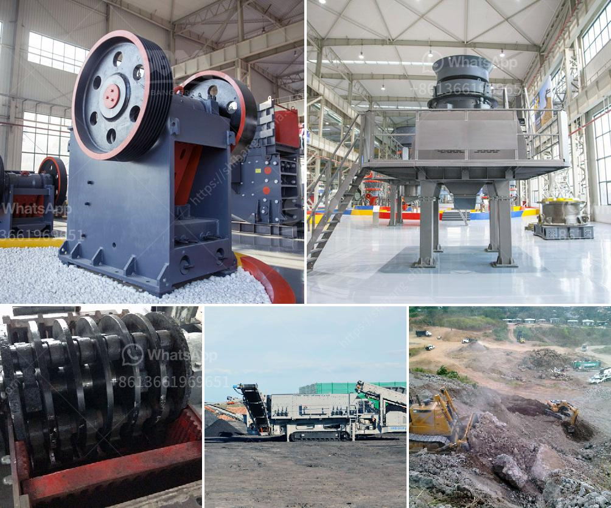

<h3>different types of roller milling</h3>
Roller milling is a popular technique used in the food processing industry to grind and crush grains, cereals, and other edible materials. It involves placing the raw material between two rollers that rotate at varying speeds to break down the particles into smaller, more manageable sizes. There are several types of roller milling techniques, each with its own unique advantages and applications.

The single roller mill is the most basic form of roller milling. It consists of a single roller that rotates against a stationary surface, such as a metal plate. This type of mill is often used for crushing grains and seeds and is commonly found in small-scale farming or home-based grain processing. It is simple and efficient but may not be suitable for large-scale production due to its limited capacity.

Double roller milling involves two rollers that rotate in opposite directions. This technique provides better control over the particle size distribution and can produce finer flour or powdered materials. It is commonly used in industrial settings for grinding delicate materials like spices, herbs, or pharmaceuticals, where careful particle size control is essential for consistent quality.

Triple roller milling, also known as three roll milling, is a more advanced technique that utilizes three rollers to crush and grind the raw material. This technique enables fine tuning of the particle size and the extraction of essential oils or flavors from the material being milled. It is widely used in the food and beverage industry for processing ingredients like chocolate, confectionery, or paints and coatings.

High-pressure roller milling is a specialized technique that applies additional pressure to the rollers to achieve even finer grinding. It is commonly used in the mining industry to break down ore particles and extract valuable minerals. This method requires robust equipment capable of withstanding high pressure and is particularly effective for hard or abrasive materials.

In conclusion, roller milling is a versatile and efficient technique used in various industries for grinding and crushing different materials. The choice of roller milling technique depends on the specific requirements of the application, such as particle size control, capacity, or extraction of essential oils or minerals. Regardless of the method used, roller milling plays a crucial role in ensuring quality and consistency in the production of various food and industrial products.
<h3>Contact us</h3><ul><li><strong>Whatsapp:&nbsp;<a href="https://wa.me/8613661969651">+8613661969651</a></strong></li><li><a href="https://swt.shibang-china.com/?git&amp;zhl&amp;different types of roller milling"><strong>Online Service(chat now)</strong></a></li></ul><h3>Related</h3><ul><li><a href='mobile crushers for sale in nigeria.md'>mobile crushers for sale in nigeria</a></li><li><a href='nigeria cone crusher photos.md'>nigeria cone crusher photos</a></li><li><a href='concrete crusher for rent in toronto.md'>concrete crusher for rent in toronto</a></li><li><a href='standard cone crusher.md'>standard cone crusher</a></li><li><a href='vertical ball grinding mills.md'>vertical ball grinding mills</a></li></ul>