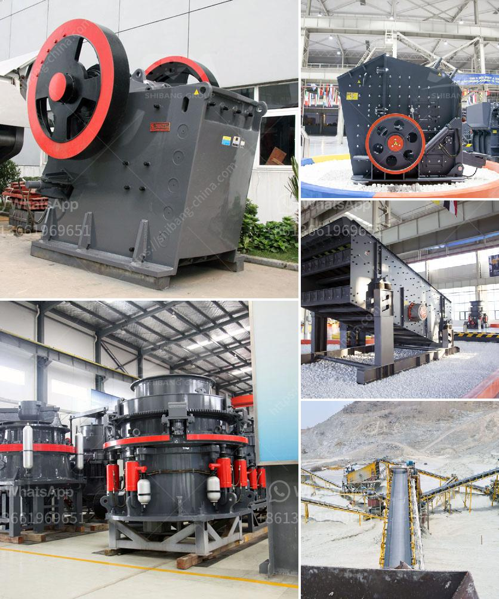

<h3>different types of vibrating screen</h3>
Vibrating screens are an important part of material screening processes, allowing for the separation of different-sized particles. There are various types of vibrating screens which can be classified into linear vibrating screens, circular vibrating screens, and high-frequency vibrating screens.

Linear vibrating screens are known for their robust construction, efficient screening capabilities, and low maintenance. These screens are mainly used for fine screening of materials and have a long lifespan. Linear vibrating screens utilize linear vibrations generated by two unbalanced eccentric shafts to move the screen horizontally along with a certain inclination. This motion allows for efficient and accurate screening of materials.

Circular vibrating screens, on the other hand, are characterized by their circular motion. These screens are widely used in the mining and construction industry due to their ability to effectively separate materials. Circular vibrating screens use an eccentric shaft vibration exciter and eccentric block to adjust the amplitude, allowing for efficient and precise screening of materials.

High-frequency vibrating screens are designed to achieve higher accuracy in the screening process. These screens operate at higher speeds compared to the traditional vibrating screens, resulting in decreased particle residence time and improved efficiency. High-frequency screens are commonly used in applications where fine particles need to be separated efficiently.

In addition to the aforementioned types, there are also specialized vibrating screens designed for specific purposes. For example, dewatering vibrating screens are used to remove excess moisture from wet materials, while trommel screens are primarily used for grading or separating particles based on size.

When selecting a vibrating screen, factors such as material type, feed rate, and desired particle size must be taken into consideration. It is also important to consider the maintenance requirements, installation techniques, and cost-effectiveness of the chosen vibrating screen.

In conclusion, vibrating screens play a crucial role in material screening processes. With various types available, it is essential to choose the right vibrating screen for specific applications to optimize screening efficiency and quality.
<h3>Contact us</h3><ul><li><strong>Whatsapp:&nbsp;<a href="https://wa.me/8613661969651">+8613661969651</a></strong></li><li><a href="https://swt.shibang-china.com/?git&amp;zhl&amp;different types of vibrating screen"><strong>Online Service(chat now)</strong></a></li></ul><h3>Related</h3><ul><li><a href='used crushers sale usa.md'>used crushers sale usa</a></li><li><a href='how to calculate the operating cost of a stone crusher.md'>how to calculate the operating cost of a stone crusher</a></li><li><a href='stone quarry companies in ghana.md'>stone quarry companies in ghana</a></li><li><a href='how to calculate crushing plant efficency.md'>how to calculate crushing plant efficency</a></li><li><a href='crushing and screening plant.md'>crushing and screening plant</a></li></ul>