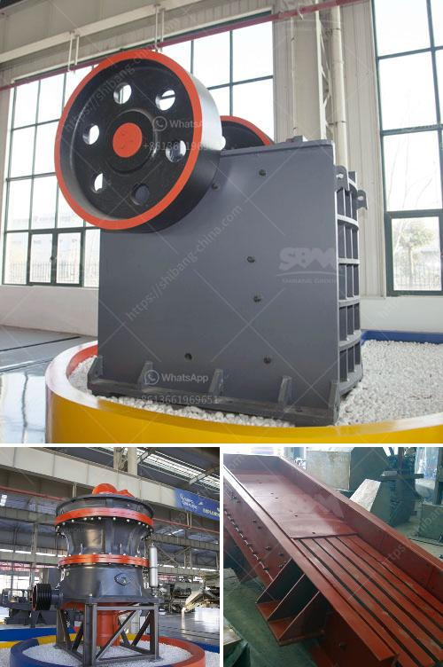

<h3>distributor stone crusher di indonesia</h3>
Indonesia is blessed with natural resources such as minerals, forests, and fertile lands. With these resources, it is no wonder that Indonesia is one of the world's largest producers of various products, including stone and its derivatives. 

Stone crusher machines are used for crushing stones in various industries such as mining, construction, and metallurgy, among others. In Indonesia, there are many distributors and suppliers who sell stone crusher machines and other mining machines. 

Being a distributor in Indonesia, one would know that there are many types of stone crushers on the market. However, we see that the traditional stone crusher that is widely used in Indonesia is a machine called a cone crusher. 

Out of all these stone crushers, the cone crusher is the most commonly used. Besides, having a wide application in the industry, this machine is also very economical to operate and affordable for people in Indonesia who are on a tight budget. 

In terms of productivity, the cone crusher performs well, since it can process a large amount of materials per hour. The finished products that the cone crusher produces are in high demand, especially in industries such as construction and infrastructure development. 

It is worth noting that while there are many stone crusher distributors in Indonesia, the quality of the products offered is not always equal. Therefore, it is important for buyers to carefully choose their stone crusher suppliers and distributors to ensure the best quality and performance. 

In conclusion, stone crusher machines have played an important role in Indonesia's mining industry. As a distributor, it is important to choose a reliable supplier to ensure quality and efficiency in the production process. By doing so, Indonesia's mining industry can continue to grow and meet the demands of various sectors.
<h3>Contact us</h3><ul><li><strong>Whatsapp:&nbsp;<a href="https://wa.me/8613661969651">+8613661969651</a></strong></li><li><a href="https://swt.shibang-china.com/?git&amp;zhl&amp;distributor stone crusher di indonesia"><strong>Online Service(chat now)</strong></a></li></ul><h3>Related</h3><ul><li><a href='mobile stone crushers for sale south africa.md'>mobile stone crushers for sale south africa</a></li><li><a href='multi vibrating screen pdf.md'>multi vibrating screen pdf</a></li><li><a href='stone crushing machine suppliers.md'>stone crushing machine suppliers</a></li><li><a href='technical parametres of impact crusher.md'>technical parametres of impact crusher</a></li><li><a href='catalog of vertical grinding mill pdf.md'>catalog of vertical grinding mill pdf</a></li></ul>