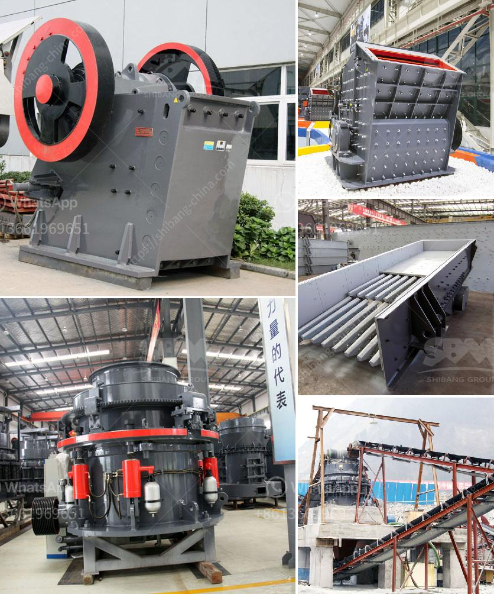

<h3>dolomite beater mill crusher</h3>
Dolomite Beater Mill Crusher is suitable for the coarse, fine and ultra-fine crushing. As a professional beater mill crusher manufacturer in China, our machines have been exported to many countries and widely used in industries such as mining, construction, metallurgy, chemical, cement, refractory materials, and ceramics.

In recent years, the demand for the dolomite beater mill crusher has increased. It is mainly used for grinding dolomite into powder. The ability to produce high-quality dolomite powder efficiently and effectively has made the beater mill crusher an indispensable dolomite crushing equipment for industries such as mining, metallurgy, and chemical.

The dolomite beater mill crusher is designed with the advantages of high productivity, low energy consumption, simple structure, convenient operation, easy maintenance, and so on. It is widely used in mining, construction materials, chemical industry, metallurgy, ceramics, and other industries.

The working principle of dolomite beater mill crusher is utilizing the rotation of the hammer to break and pulverize the dolomite into small pieces. The grinding chamber of the machine is lined with serrated liners and has a good sealing performance, which eliminates the dust pollution during the operation.

The dolomite beater mill crusher has the features of reliable performance, good stability, low energy consumption, high efficiency, and convenient maintenance. There are various types of dolomite crushers commonly used in the market, such as jaw crushers, impact crushers, cone crushers, and sand making machines, etc.

The sand making machine is mainly used for the shaping of dolomite particles. It uses impacting and grinding to achieve the best crushing effect, and can produce the best-formed dolomite particles. The dolomite beater mill crusher is suitable for the medium and fine crushing operation of dolomite, limestone, flint, clay, coal, burning stone, slag, furnace slag and other materials.

In recent years, the dolomite beater mill crusher has been favored by customers due to its wide range of applications and superior performance. With the continuous expansion of the dolomite market, demand for the dolomite beater mill crusher has gradually increased, which has brought higher market competitiveness to the manufacturers.

As a professional dolomite beater mill crusher manufacturer, we have established long-term cooperation with many customers. Our machines have been widely used in the dolomite crushing plants, construction, and mining industries. We provide comprehensive services to customers, including dolomite crushing plant design, installation, and guidance.

In conclusion, the dolomite beater mill crusher is suitable for processing 300-500mm dolomite particles into 65-325 mesh powder, and the output can reach 1-20 tons per hour. It is widely used in metallurgy, construction materials, chemicals, and other industries. It can be used as a dolomite crushing machine in the dolomite beneficiation plant. Furthermore, the dolomite beater mill crusher is the efficient and reliable dolomite processing solution for businesses.
<h3>Contact us</h3><ul><li><strong>Whatsapp:&nbsp;<a href="https://wa.me/8613661969651">+8613661969651</a></strong></li><li><a href="https://swt.shibang-china.com/?git&amp;zhl&amp;dolomite beater mill crusher"><strong>Online Service(chat now)</strong></a></li></ul><h3>Related</h3><ul><li><a href='bush crusher machine.md'>bush crusher machine</a></li><li><a href='micro powder mill cost.md'>micro powder mill cost</a></li><li><a href='to buy gypsum calcination rotary kiln plant.md'>to buy gypsum calcination rotary kiln plant</a></li><li><a href='second hand automatic crusher plant.md'>second hand automatic crusher plant</a></li><li><a href='slag powder grinding in india.md'>slag powder grinding in india</a></li></ul>