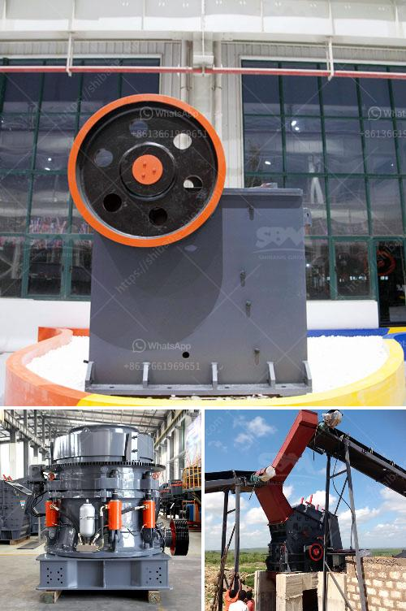

<h3>dolomite crusher machine plant</h3>
Dolomite is a calcium magnesium carbonate mineral that has many characteristics similar to calcite. In places where access to limestone is not available, or more costly than dolomite, dolomite is used as a replacement material. Dolomite is used to make various products such as construction materials, ceramics, glass, detergents and fertilizers. The minerals that are found in dolomite can remove impurities and help improve the quality of various products.

To process dolomite, firstly dolomite is burnt, hardened and then made into small pellets and heated again. These pellets are then used for making sponge iron. Rotary kilns have a drawback upon the size and quality of iron ore that can be used. Initially, when the process was first introduced, the ore with an iron content >/= 65% was preferred and the preferred size of ore was -5-18mm. And coal of minimum “B” grade was required to be used for the solid state reduction or DRI making process.

In recent years, with growing iron ore prices and limited availability of high-grade ore, low-grade ore and tailings are being used as alternative materials for the conventional iron making process. The size specifications of ore viz. -5-18mm, -10-30mm, -20-40mm, -40-80mm, -80+40mm are used for all the same purpose and that is to fill voids in the concrete. It not only reduces the cost of concrete, but is also a safe option for demolition work.

The process involves crushing, screening, grinding, aging, and packing, so the characteristics of the processed dolomite can be formed. With the expansion of the infrastructure development policy, the application fields of dolomite are increasingly wide. The processed dolomite can be used in various industries such as construction, building materials, chemicals, agriculture, environmental protection, energy saving, etc.

The dolomite crushing production line typically consists of conveyor belt, vibrating feeder, crushing unit, dolomite crusher (jaw crusher, impact crusher or cone crusher), vibrating screen, and belt conveyor. We provide high performance crushing plant for dolomite processing. Crushing plant for dolomite production can be equipped with jaw crusher, impact crusher, cone crusher, vibrating screen and belt conveyor. The complete dolomite crushing plant consists of dolomite crusher, vibrating feeder and vibrating screen. There are several types of stone crushers that can be used as dolomite crusher.

Jaw crusher is the primary crusher that is used for primary crushing. It is the common dolomite crusher in dolomite mining. The range of final size of products can be 10-300 mm, and the capacity can be up to 100 t/p.

Impact crusher is the secondary crusher. This crushing machine features reasonable structure, high productivity, easy operation and maintenance and safe performance. The most advantage of it is that the final particle is in good, cubic shape and without tensility and cranny.

Cone crusher is the secondary or tertiary dolomite crusher; it is suitable for hard and mid-hard rocks and ores, such as iron ores, copper ores, limestone, quartz, granite, gritstone, etc.

In the modern industry, dolomite has a wide application in the field such as construction materials, refractory materials, agriculture and chemical industry, etc. Therefore, now in the market, the demand for dolomite is increasing. So it is necessary to produce equipment that can break dolomite stone efficiently to meet the production requirements. Hence, some people think that quarry crusher machine is the key to determine success or failure of ore production line. Therefore, the ore beneficiation process should always pay attention to grinding process and beneficiation process.
<h3>Contact us</h3><ul><li><strong>Whatsapp:&nbsp;<a href="https://wa.me/8613661969651">+8613661969651</a></strong></li><li><a href="https://swt.shibang-china.com/?git&amp;zhl&amp;dolomite crusher machine plant"><strong>Online Service(chat now)</strong></a></li></ul><h3>Related</h3><ul><li><a href='pe 200 x 300 stone crusher.md'>pe 200 x 300 stone crusher</a></li><li><a href='100tph small capacity granite crusher.md'>100tph small capacity granite crusher</a></li><li><a href='small stone crusher supplier in the philippines.md'>small stone crusher supplier in the philippines</a></li><li><a href='price of grinder machine in pakistan.md'>price of grinder machine in pakistan</a></li><li><a href='impact coal crusher.md'>impact coal crusher</a></li></ul>