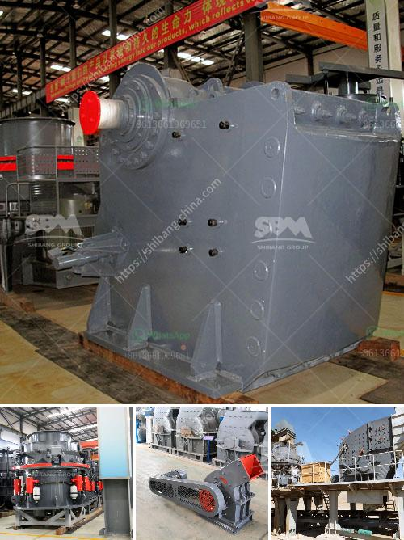

<h3>dolomite crushers for sale</h3>
Dolomite is a limestone mineral that is commonly found in sedimentary rock deposits throughout the world. It has a distinctive pink color and is typically used as a construction and decorative material. In recent years, dolomite has gained popularity as an agricultural supplement for soil and livestock.

To meet the growing demand for dolomite, efficient crushing equipment is required. Here, we present a comprehensive analysis of dolomite crushers for sale, discussing their features, working principles, benefits, and market trends.

Dolomite crushers are specialized machines designed to crush and grind dolomite rocks into smaller particles. They are usually applied in the mining industry and construction industry for crushing minerals, rocks, and building materials. These crushers are also often used to recycle construction waste, reducing environmental impact and increasing economic benefits.

There are different types of dolomite crushers available in the market. They vary in their sizes, capacities, and crushing efficiencies. Some of the commonly used types of dolomite crushers include jaw crushers, cone crushers, impact crushers, and VSI crushers.

Jaw crushers are the most commonly used primary crushers for crushing dolomite. They have great crushing capacities and high reduction ratios. Due to their simplicity and ease of maintenance, jaw crushers are widely used in many industries. They are suitable for handling various materials, including soft and hard rocks.

Cone crushers are another popular type of dolomite crusher. They are generally used for secondary or tertiary crushing stages. With high crushing efficiency and excellent particle shape, cone crushers are ideal for crushing dolomite rocks into cubical particles. Additionally, they have low operating costs and are easy to maintain.

Impact crushers are often used as secondary crushers when processing dolomite for road construction or building materials. They utilize the impact force to crush the material, resulting in high reduction ratios and excellent particle shape. Impact crushers are versatile and can handle both soft and hard rocks, making them suitable for various applications.

VSI crushers, also known as vertical shaft impact crushers, are commonly used in the last stage of the crushing process to produce high-quality sand and aggregate for construction purposes. VSI crushers have the ability to handle hard, abrasive, fine, moist, or sticky materials. They are highly efficient crushers, providing excellent shaping and particle size control.

When considering purchasing a dolomite crusher, several factors should be taken into account. These factors include the required product size, capacity, energy consumption, maintenance requirements, and overall cost. It is crucial to choose a crusher that suits the specific needs of your project while minimizing downtime and maximizing productivity.

The market for dolomite crushers is steadily growing due to the increasing demand for construction and agricultural materials. The rise in infrastructure and construction projects worldwide has fueled the need for dolomite crushers. Additionally, the growing popularity of dolomite as a soil supplement in agriculture further boosts the demand for efficient dolomite crushers.

In conclusion, dolomite crushers are essential equipment in the mining and construction industries. They provide efficient and economical solutions for crushing dolomite rocks into smaller particles, enabling easy processing and transportation. When choosing a dolomite crusher, it is crucial to consider factors such as product size, capacity, and energy consumption to meet specific project requirements. With the steady growth of the construction and agricultural industries, the market for dolomite crushers is expected to expand further in the coming years.
<h3>Contact us</h3><ul><li><strong>Whatsapp:&nbsp;<a href="https://wa.me/8613661969651">+8613661969651</a></strong></li><li><a href="https://swt.shibang-china.com/?git&amp;zhl&amp;dolomite crushers for sale"><strong>Online Service(chat now)</strong></a></li></ul><h3>Related</h3><ul><li><a href='mining ball mill.md'>mining ball mill</a></li><li><a href='stone crushers baby.md'>stone crushers baby</a></li><li><a href='rock crusher screen.md'>rock crusher screen</a></li><li><a href='barite washing equipment.md'>barite washing equipment</a></li><li><a href='mobile stone crusher plant.md'>mobile stone crusher plant</a></li></ul>