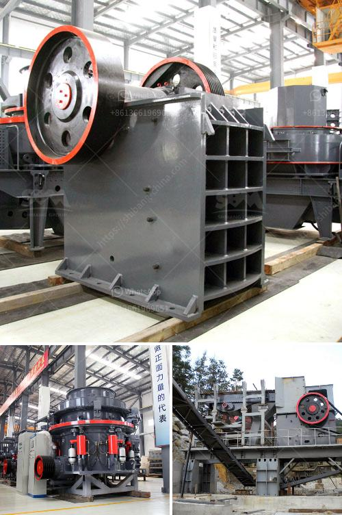

<h3>dolomite powder mill machinery</h3>
Dolomite is a natural mineral composed of calcium magnesium carbonate. It is commonly used as a filler material in the manufacturing industry, such as building materials, paint, and ceramics. However, dolomite powder can also be used as a raw material for producing dolomite powder mill machinery.

Dolomite powder mill machinery is essential in the dolomite processing industry. The machinery is also popular in building materials, chemical engineering, and metallurgy industries for size reduction, dispersion, or specialized needs. Dolomite powder mill machinery consists of jaw crusher, bucket elevator, vibrating feeder, main unit, classifier, collector, and high-pressure blower.

Dolomite powder mill machinery is widely applied in construction, chemical industry, metallurgy, and other fields, making great contributions to the development of society. With the further development of mining equipment industry and technological advances, Hongxing dolomite powder mill machinery has become one of the indispensable equipment in construction industry as well as the metallurgy and chemistry industries.

In recent years, with the rapid development of the construction industry, the demand for dolomite powder has increased dramatically. This has led to the booming of dolomite powder mill machinery. Dolomite powder mill machinery not only meets the requirements of environmental protection, but also greatly improves the resource utilization rate of dolomite resources.

The developed dolomite powder mill machinery by Hongxing not only has high production capacity but also efficient energy consumption. Compared with traditional mills, the new dolomite powder mill machinery equipment has high efficiency, low power consumption, small floor space, and small one-time investment. The grinding roller and grinding ring of the dolomite powder mill machinery have a longer replacement period, which eliminates the disadvantages of the short replacement period of the fragile parts of the centrifugal grinder. The operation principle of dolomite powder mill machinery is to crush materials through the collision between hammer and materials. There is high-pressure spring inside this machinery. In the working process, grinding roller starts to rotate. Under the function of high-pressure spring and centrifugal force, the grinding roller rolls against the grinding ring. Meanwhile, the materials slip and spill from the feeding opening and get into the cabin. After being grinded in the first cabin, the materials enter the second cabin inside the grinding mill. By adopting optimal design of the mixing extruding working principle, the materials become homogenized. The grinding roller and grinding ring get worn equally. Dolomite powder mill machinery promotes the isothermal transformation of crystals and decomposition of metastable minerals, thus greatly improving the quality of dolomite products.

In conclusion, dolomite powder mill machinery plays an important role in the construction, metallurgy, and chemical industry. The dolomite powder mill machinery produced by Hongxing has professional grinding technology, stable performance and reliable quality. To enhance production, Hongxing dolomite powder mill machinery adopts the grinding roller and grinding ring which has high wear resistance and good toughness, thus prolonging the service life of the whole equipment. With its excellent performance, dolomite powder mill machinery has become an important equipment in the industry. Its emergence not only injects new vitality into the development of the industry but also promotes the optimization and upgrading of related industries.
<h3>Contact us</h3><ul><li><strong>Whatsapp:&nbsp;<a href="https://wa.me/8613661969651">+8613661969651</a></strong></li><li><a href="https://swt.shibang-china.com/?git&amp;zhl&amp;dolomite powder mill machinery"><strong>Online Service(chat now)</strong></a></li></ul><h3>Related</h3><ul><li><a href='cost of setting up quarry plant in nigeria.md'>cost of setting up quarry plant in nigeria</a></li><li><a href='slag grinding process.md'>slag grinding process</a></li><li><a href='hammer mill dealer in cebu.md'>hammer mill dealer in cebu</a></li><li><a href='pe series jaw crusher and ton per day.md'>pe series jaw crusher and ton per day</a></li><li><a href='silica sand washing plant in malaysia.md'>silica sand washing plant in malaysia</a></li></ul>