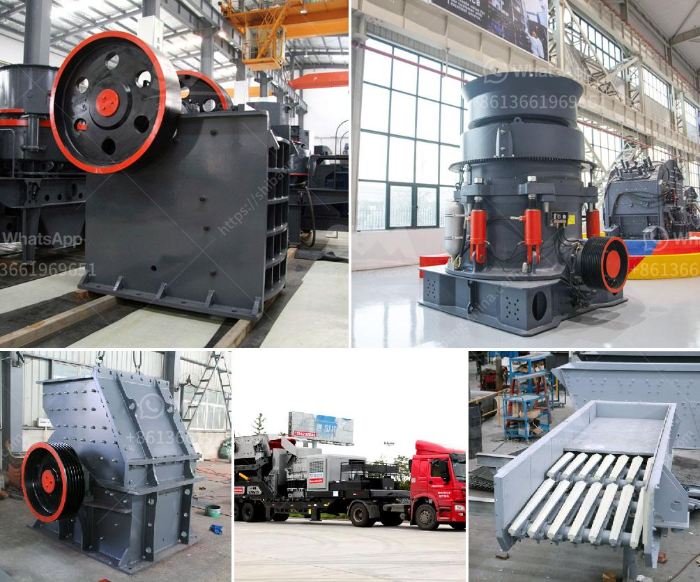

<h3>dolomite powder plant</h3>
Dolomite is a mineral that is commonly found in sedimentary rocks, and its unique chemical composition of calcium and magnesium makes it a valuable resource for various industries. Dolomite is typically used as an ingredient in the production of ceramics, glass, and cement. It is also used in the agricultural sector to enhance soil quality and promote plant growth. 

To harness the potential of dolomite, many industries rely on dolomite powder plants. These plants are designed to crush, grind, and process dolomite into a fine powder, which can then be used in various applications. Here, we will explore the importance and benefits of a dolomite powder plant.

One of the key advantages of a dolomite powder plant is its ability to produce a consistent and high-quality powder. The plant utilizes specialized machinery and equipment to ensure the dolomite is finely ground and processed to meet the specific requirements of different industries. This consistency is crucial for industries like ceramics and glass manufacturing, where the quality of the raw materials directly affects the final product's properties.

In the ceramics industry, dolomite powder is added to clays and other materials to improve plasticity, reduce shrinkage, and enhance the durability of the finished products. Dolomite's properties make it an excellent fluxing material, which helps lower the melting point of ceramic mixtures, enabling better control over firing temperatures and energy consumption. This results in higher-quality ceramics that are more cost-effective to produce.

Similarly, the glass industry utilizes dolomite powder to enhance glass durability and resistance to chemical corrosion. Dolomite's high melting point makes it an ideal component in the production of heat-resistant glass. By adding dolomite powder to the glass mixture, manufacturers can achieve a high-quality finished product that is resistant to thermal shock and retains its clarity over time.

Another significant application of dolomite powder is in the construction industry. Dolomite acts as a filler material in cement, giving it increased strength, hardness, and resistance to chemical attack. This makes dolomite powder an essential additive for cement production, helping to improve its overall performance and versatility.

In the agricultural sector, dolomite powder is widely used as a soil conditioner. It helps neutralize acidic soils, improves the soil's ability to retain nutrients, and enhances water retention. Adding dolomite to the soil can also reduce the risk of nutrient deficiencies and promote healthy plant growth. As a result, farmers and gardeners rely on dolomite powder to enhance soil productivity and optimize crop yields.

In conclusion, dolomite powder plants play a crucial role in various industries, offering a reliable and consistent supply of high-quality dolomite powder. From ceramics and glass manufacturing to cement production and agriculture, dolomite powder is a valuable resource with diverse applications. Through the efficient processing and utilization of dolomite, these plants contribute to the growth and development of multiple sectors, ultimately benefiting society as a whole.
<h3>Contact us</h3><ul><li><strong>Whatsapp:&nbsp;<a href="https://wa.me/8613661969651">+8613661969651</a></strong></li><li><a href="https://swt.shibang-china.com/?git&amp;zhl&amp;dolomite powder plant"><strong>Online Service(chat now)</strong></a></li></ul><h3>Related</h3><ul><li><a href='stone crusher turkey.md'>stone crusher turkey</a></li><li><a href='gypsum powder line.md'>gypsum powder line</a></li><li><a href='stone quarry crusher in kasoa.md'>stone quarry crusher in kasoa</a></li><li><a href='tertiary impact crushers for quartz.md'>tertiary impact crushers for quartz</a></li><li><a href='rudra industries ball mill manufacturers.md'>rudra industries ball mill manufacturers</a></li></ul>