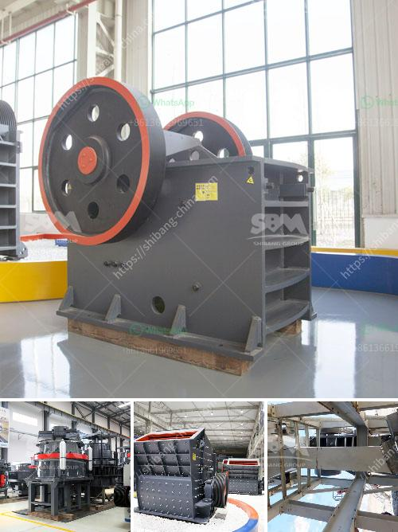

<h3>dolomite production</h3>
Dolomite, a mineral found in sedimentary rocks, has a wide range of applications across various industries. Its production plays a significant role in meeting the demands of these industries and contributing to economic growth. In this article, we will explore the process of dolomite production and its uses.

Dolomite is a calcium and magnesium carbonate mineral that is commonly found in limestone deposits. It is formed through the alteration of calcium-rich sediments or by the substitution of magnesium for calcium in the crystal structure of limestone. This mineral is typically white or gray in color, with a pearly or glassy luster.

The production of dolomite involves several stages. Initially, the sedimentary rocks containing dolomite are excavated through mining operations. The extracted rocks are then crushed and processed to remove impurities. This process includes screening and washing the dolomite to achieve the desired quality and size. The final product is then ready for various industrial applications.

Dolomite is widely used in the construction industry as a raw material for cement production. It serves as a flux in the manufacturing process, enabling the reduction of energy and emissions. Dolomite also enhances the properties of cement by improving its strength, durability, and resistance to chemical attack. Moreover, it provides excellent workability and stability to concrete, making it an essential component in the construction of buildings, roads, and bridges.

In agriculture, dolomite plays a crucial role in maintaining soil pH levels. It is commonly used as a soil conditioner and fertilizer to neutralize acidic soils. The unique properties of dolomite, including its ability to release calcium and magnesium ions, make it an ideal choice for improving soil fertility and promoting plant growth. Farmers often apply dolomite to their fields to enhance crop yields and overall agricultural productivity.

Dolomite is also utilized in the production of glass and ceramics. Its high melting point and low thermal expansion make it suitable for creating glass products, such as windows, bottles, and glass fibers. In ceramics, dolomite acts as a fluxing agent, reducing the melting point of clay and facilitating the formation of glazes and enamels. Additionally, dolomite is used in the production of refractory bricks, which are highly resistant to heat and serve as lining materials in furnaces and kilns.

Other industries that extensively use dolomite include steel manufacturing, water treatment, and the production of magnesium oxide. In the steel industry, dolomite is added to the iron ore before entering the blast furnace to improve the quality of the final product. Water treatment plants use dolomite to remove impurities, such as heavy metals, from contaminated water sources. Furthermore, dolomite is a vital source of magnesium oxide, which is essential for the production of magnesium alloys, fertilizers, and various industrial applications.

In conclusion, dolomite production is a significant process that caters to multiple industries. From construction and agriculture to glass manufacturing and steel production, dolomite finds its way into various applications. Its unique qualities, such as enhancing cement strength, improving soil conditions, and serving as a flux in glass and ceramics, make it an indispensable mineral in our daily lives. The continued production of dolomite ensures the availability of this valuable resource and contributes to economic development worldwide.
<h3>Contact us</h3><ul><li><strong>Whatsapp:&nbsp;<a href="https://wa.me/8613661969651">+8613661969651</a></strong></li><li><a href="https://swt.shibang-china.com/?git&amp;zhl&amp;dolomite production"><strong>Online Service(chat now)</strong></a></li></ul><h3>Related</h3><ul><li><a href='portable gold mining plant pdf.md'>portable gold mining plant pdf</a></li><li><a href='small stone crusher plant in india.md'>small stone crusher plant in india</a></li><li><a href='gold crusher in south africa.md'>gold crusher in south africa</a></li><li><a href='portable quarry crushers for sale in the usa.md'>portable quarry crushers for sale in the usa</a></li><li><a href='stone jaw crushers in japan.md'>stone jaw crushers in japan</a></li></ul>