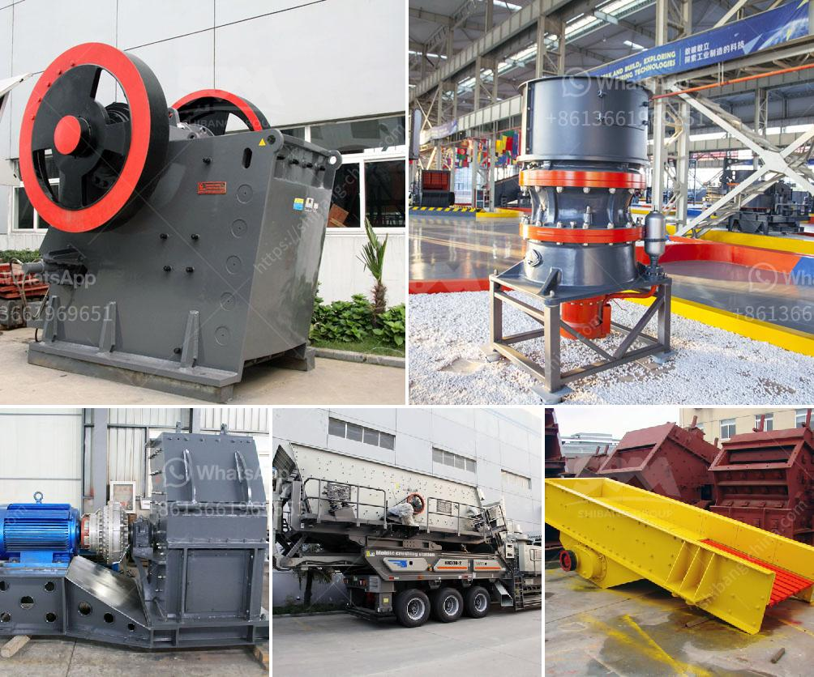

<h3>drums for conveyor belts</h3>
In the world of material handling, conveyor belts play a crucial role in efficiently moving items from point A to point B. What many people may not realize is that the impressive performance of these belts is largely dependent on the functionality of the drums that power them. Drums for conveyor belts are the unsung heroes of material handling, silently driving the smooth and continuous movement of goods across various industries.

One of the key functions of drums is to provide the necessary traction to keep the conveyor belt moving. These drums are typically made of robust materials such as steel or rubber. The surface of the drum may be textured or coated with specialized materials to enhance friction and prevent slippage. By gripping the belt and providing the required traction, the drums ensure a steady flow of materials throughout the system.

Additionally, drums play a vital role in tensioning the conveyor belt. Tensioning drums are strategically placed to maintain the required tension, preventing sagging or loosening of the belt which can lead to inefficient operation or complete breakdown. Proper tensioning of the belt maximizes its lifespan and reduces the risk of costly repairs or replacements.

Another critical aspect of drums is their ability to effectively dissipate heat. Conveyor belts are often subject to heavy loads and high-speed operation, generating significant heat. To counter this, drums are equipped with specialized cooling features such as fins or cooling fans. Efficient heat dissipation prevents belt damage and ensures consistent performance, even under demanding operating conditions.

When it comes to drum design, manufacturers consider factors such as load capacity, belt speed, and the specific requirements of the materials being transported. This customization ensures that drums are capable of handling varying load sizes, speeds, and working environments. Whether it's transporting bulk materials in a mine, packages in a distribution center, or baggage at an airport, the appropriate drum design will ultimately determine the efficiency and reliability of the conveyor belt system.

In conclusion, while conveyor belts are often the stars of the show when it comes to material handling, drums for conveyor belts should not be overlooked. They provide the essential traction, tension, and heat dissipation required for the smooth and continuous operation of these systems. By understanding and appreciating the role of these seemingly simple components, we can better grasp the complexity and importance of effective material handling in various industrial settings.
<h3>Contact us</h3><ul><li><strong>Whatsapp:&nbsp;<a href="https://wa.me/8613661969651">+8613661969651</a></strong></li><li><a href="https://swt.shibang-china.com/?git&amp;zhl&amp;drums for conveyor belts"><strong>Online Service(chat now)</strong></a></li></ul><h3>Related</h3><ul><li><a href='quartz powder making.md'>quartz powder making</a></li><li><a href='price of industrial hammer mill.md'>price of industrial hammer mill</a></li><li><a href='nigeria vertical mill machine.md'>nigeria vertical mill machine</a></li><li><a href='south africa mining law on crusher.md'>south africa mining law on crusher</a></li><li><a href='limestone rock crusher.md'>limestone rock +crusher</a></li></ul>