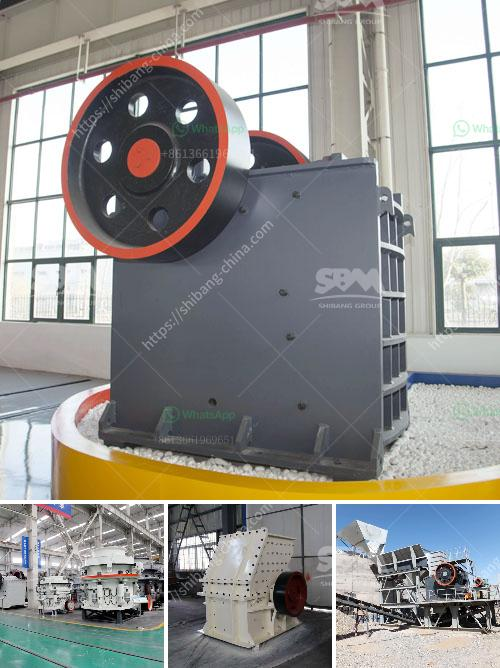

<h3>dust pollution control machine for stone crusher</h3>
Dust pollution in stone crusher units in and around Balasore, Orissa has been a major concern for both the local community and policymakers. Such pollution creates significant health risks for individuals living in the vicinity of these stone crushing units.

Existing stone crushing machines often emit a significant amount of air pollutants due to inadequate dust control mechanisms and inefficient dust suppression systems. In most cases, the same machine used for crushing rocks can be utilized to process all recycled material, resulting in a more efficient operation.

A dust pollution control machine is a device used to suppress the dust particles in the vicinity of the crusher by dispersing a water mist. The machine operates by spraying water onto the crushing chambers and surrounding areas in order to reduce the amount of dust generated during the crushing process.

One of the key benefits of using a dust pollution control machine is its ability to improve the air quality and overall health of the surrounding community. By suppressing dust particles, it minimizes the health risks associated with breathing in these harmful pollutants. The machine helps create a safe and clean environment for both the workers at the stone crushing unit and the residents living nearby.

Moreover, the use of a dust pollution control machine also leads to increased efficiency in the stone crushing process. By reducing the amount of dust generated during the operation, the machine helps to maintain a clean working environment, enabling workers to perform their tasks more effectively. It also reduces the need for frequent cleaning and maintenance, thus saving time and resources.

In conclusion, a dust pollution control machine plays a crucial role in minimizing air pollution caused by stone crushing units. It not only protects the health of the community but also enhances the overall efficiency of the stone crushing process. Authorities and stone crusher operators should consider the installation of such machines to control dust emissions and contribute to a cleaner and healthier environment.
<h3>Contact us</h3><ul><li><strong>Whatsapp:&nbsp;<a href="https://wa.me/8613661969651">+8613661969651</a></strong></li><li><a href="https://swt.shibang-china.com/?git&amp;zhl&amp;dust pollution control machine for stone crusher"><strong>Online Service(chat now)</strong></a></li></ul><h3>Related</h3><ul><li><a href='hot used trommel screen machine in sand.md'>hot used trommel screen machine in sand</a></li><li><a href='mobile jaw crusher for sale india used price.md'>mobile jaw crusher for sale india used price</a></li><li><a href='metal crusher for rent.md'>metal crusher for rent</a></li><li><a href='top crusher manufacturer.md'>top crusher manufacturer</a></li><li><a href='portable crushing and screening.md'>portable crushing and screening</a></li></ul>