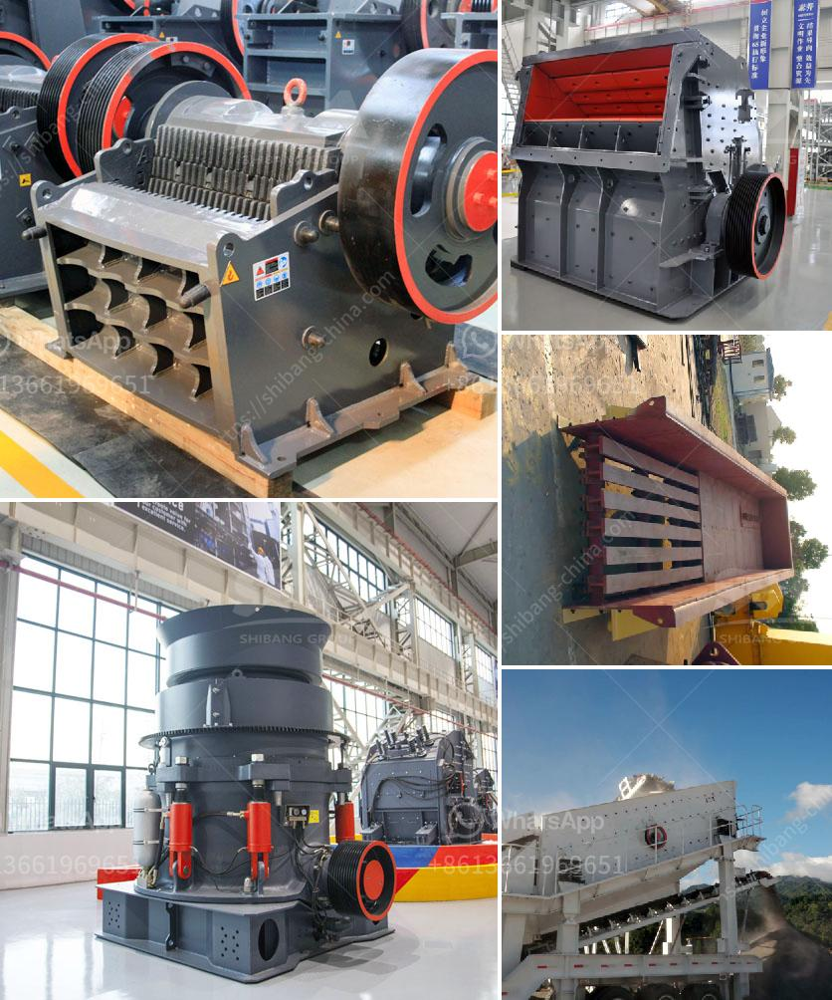

<h3>egypt aggregate stone for concrete prices</h3>
Egyptian aggregate stone is an essential component in the construction industry, particularly for concrete production. With its durability and versatility, it has become a preferred choice for contractors and builders alike. However, the prices of aggregate stone in Egypt can vary depending on various factors.

One of the major factors influencing the prices of aggregate stone is the availability of raw materials. Egypt is blessed with abundant natural resources, including high-quality limestone and granite, which are commonly used as aggregate stone. This availability of raw materials enables the country to produce an ample supply of aggregate stone, ensuring competitive prices.

In addition to the availability of raw materials, transportation costs can also affect the prices of aggregate stone. The distance between the quarry and the construction site plays a crucial role in determining transportation costs. Urban areas with easy access to transportation routes tend to have lower prices due to reduced transportation expenses, while remote or rural locations may result in higher prices.

Another factor influencing the prices of aggregate stone is market demand. When there is high demand for construction projects, such as infrastructure development or real estate boom, the prices of aggregate stone tend to rise. On the contrary, during periods of economic slowdown or reduced construction activities, prices may stabilize or even decrease.

The quality of aggregate stone can also impact its pricing. Egyptian aggregate stone is known for its high-quality characteristics, with strict quality control measures in place during the production process. Higher-quality stone will generally fetch a higher price due to its enhanced properties and durability, providing long-term benefits for construction projects.

Overall, Egypt offers a wide range of aggregate stone options at competitive prices. As one of the leading suppliers in the region, the country has established itself as a reliable source for high-quality aggregate stone for concrete production. By considering the factors mentioned above, contractors and builders can make informed decisions and secure the best prices for their construction projects.
<h3>Contact us</h3><ul><li><strong>Whatsapp:&nbsp;<a href="https://wa.me/8613661969651">+8613661969651</a></strong></li><li><a href="https://swt.shibang-china.com/?git&amp;zhl&amp;egypt aggregate stone for concrete prices"><strong>Online Service(chat now)</strong></a></li></ul><h3>Related</h3><ul><li><a href='mill crusher pigment manufacturer in kenya.md'>mill crusher pigment manufacturer in kenya</a></li><li><a href='price of plant crusher in nigeria.md'>price of plant crusher in nigeria</a></li><li><a href='stone crushers hydraulic.md'>stone crushers hydraulic</a></li><li><a href='high capacity fine stone quarry crusher machine.md'>high capacity fine stone quarry crusher machine</a></li><li><a href='vertical vertical inspection method.md'>vertical vertical inspection method</a></li></ul>