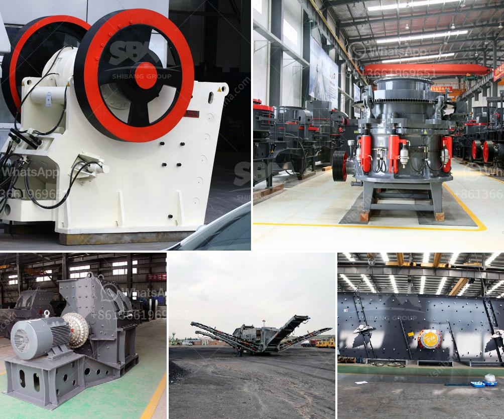

<h3>enquiry about impact crusher</h3>
The construction industry is witnessing a significant rise in demand for durable and high-quality building materials. As a result, the need for efficient and reliable crushing equipment has become paramount. Among the wide range of crushers available in the market, the impact crusher has emerged as a popular choice due to its superior features and versatility.

An impact crusher is a machine that uses striking as opposed to pressure to reduce the size of a material. This unique attribute makes it suitable for various applications, including the manufacturing of sand, concrete aggregate, and even recycling projects. The machine operates by throwing the material against a hard surface, causing it to break into smaller pieces.

With the growing demand for construction materials, many companies are exploring the possibility of investing in impact crushers. However, before making such a significant investment, it is crucial to conduct a thorough enquiry. This enquiry should focus on understanding the key features and benefits of the impact crusher, as well as evaluating its performance and reliability.

One of the primary advantages of an impact crusher is its high capacity and efficiency. These machines are known for their ability to handle large volumes of material, making them ideal for crushing rocks, ores, and other hard substances. Additionally, the crushers can achieve a uniform product size, ensuring consistent quality for construction projects.

Another important aspect to consider when enquiring about an impact crusher is its durability and longevity. The construction industry operates in harsh environments, exposing machinery to extreme conditions. Therefore, it is crucial to choose a crusher that can withstand constant usage and resist wear and tear. Enquirers should pay particular attention to the materials used in the manufacturing of the crusher, making sure they are of high quality and capable of withstanding heavy use.

The ease of maintenance is another key factor that enquirers should consider. As with any mechanical equipment, regular maintenance is essential to ensure optimal performance and prevent unexpected breakdowns. Therefore, it is recommended to enquire about the availability of spare parts, the accessibility of maintenance points, and whether the manufacturer provides comprehensive after-sales support.

Additionally, it is worth enquiring about the safety features incorporated in the impact crusher. The construction industry inherently poses various safety risks, and it is important to choose a machine that prioritizes the well-being of its operators. Enquirers should ask about safety features such as emergency stop buttons, safety guards, and advanced control systems.

Enquiring about the impact crusher's energy efficiency is also important. The construction industry is increasingly embracing sustainable practices, and reducing energy consumption is a crucial aspect of this movement. A highly efficient impact crusher not only minimizes energy consumption but also reduces operational costs.

In conclusion, when considering an investment in an impact crusher, it is imperative to conduct a detailed enquiry. This enquiry should cover crucial aspects such as capacity, durability, maintenance requirements, safety features, and energy efficiency. By addressing these factors, construction companies can make an informed decision that will contribute to their long-term success and enable them to meet the growing demand for high-quality construction materials.
<h3>Contact us</h3><ul><li><strong>Whatsapp:&nbsp;<a href="https://wa.me/8613661969651">+8613661969651</a></strong></li><li><a href="https://swt.shibang-china.com/?git&amp;zhl&amp;enquiry about impact crusher"><strong>Online Service(chat now)</strong></a></li></ul><h3>Related</h3><ul><li><a href='chrome washing plant for sale.md'>chrome washing plant for sale</a></li><li><a href='gypsum fertilizer granulator for sale.md'>gypsum fertilizer granulator for sale</a></li><li><a href='sell stone crusher in philippines.md'>sell stone crusher in philippines</a></li><li><a href='mobile crushers hire in south africa.md'>mobile crushers hire in south africa</a></li><li><a href='pebble crusher shanghai manufacturers.md'>pebble crusher shanghai manufacturers</a></li></ul>