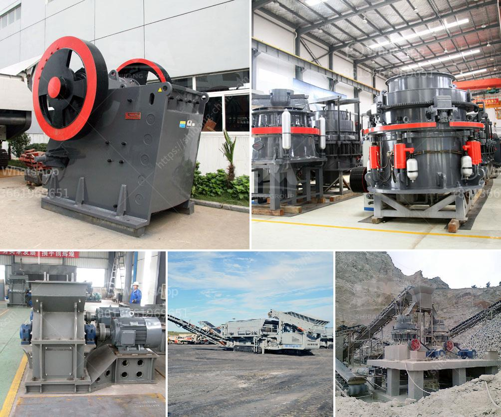

<h3>enquiry about stone crusher</h3>
In today's modern world, technology is constantly advancing and evolving. As such, industries are becoming more efficient, streamlined, and focused on providing high-quality products and services. One industry that has seen significant improvements is the stone crushing industry.

Stone crushers are machines that are designed to reduce the size of rocks or gravel for construction purposes. These machines are essential for various construction projects, including building roads, bridges, and structures. They come in different sizes and are capable of crushing rocks into various sizes, depending on the requirements.

When it comes to purchasing stone crushers, conducting proper enquiry is essential. There are several factors to consider before making a purchase. Firstly, it is crucial to determine the specific requirements of the project. This includes understanding the type of stone or material that needs to be crushed, the size requirement, and the desired output capacity.

Once the requirements are clear, the next step is to research and find reliable stone crusher manufacturers or suppliers. It is advisable to seek recommendations from industry professionals or colleagues who have prior experience with stone crushers. Reading customer reviews and testimonials is also beneficial in understanding the reliability and quality of the products offered.

Cost is another crucial factor to consider. Different stone crushers come with varying price tags, depending on their features, quality, and capacity. It is essential to set a budget and look for options that fit within that range without compromising on quality.

Enquiring about the warranty, after-sales service, and maintenance requirements is also necessary. Stone crushers require regular maintenance to ensure their longevity and optimal performance. Inquiring about these aspects helps in making an informed decision and avoiding future hassles.

Furthermore, checking the availability of spare parts and the ease of sourcing them is vital. Stone crushers consist of several components, and if any part breaks down, it should be readily available for replacement. Ensuring the availability of spare parts helps in minimizing downtime and avoiding disruptions to ongoing projects.

In conclusion, enquiring about stone crushers is a crucial step in ensuring the success and efficiency of construction projects. It is important to determine the specific requirements, research reliable suppliers, consider the cost, warranty, after-sales service, maintenance requirements, and availability of spare parts before making a purchase. By doing so, one can be assured of acquiring a high-quality crusher that meets their project needs and provides value for money.
<h3>Contact us</h3><ul><li><strong>Whatsapp:&nbsp;<a href="https://wa.me/8613661969651">+8613661969651</a></strong></li><li><a href="https://swt.shibang-china.com/?git&amp;zhl&amp;enquiry about stone crusher"><strong>Online Service(chat now)</strong></a></li></ul><h3>Related</h3><ul><li><a href='quartz grinding plants in philippines.md'>quartz grinding plants in philippines</a></li><li><a href='crusher in coal mining.md'>crusher in coal mining</a></li><li><a href='stone crusher machine philippines.md'>stone crusher machine philippines</a></li><li><a href='jaw crusher for sale in saudi.md'>jaw crusher for sale in saudi</a></li><li><a href='aggregates crusher plant for sale in south africa.md'>aggregates crusher plant for sale in south africa</a></li></ul>