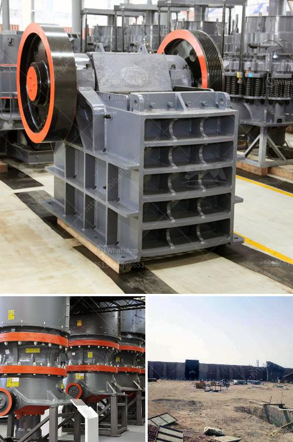

<h3>enquiry jaw crusher</h3>
When it comes to rock crushing equipment, there is a name that stands out in the industry - enquiry jaw crusher. This robust and reliable machine has been around for many years, serving various industries and fulfilling diverse crushing needs. With its advanced features and superior performance, the enquiry jaw crusher has become a popular choice among professionals and companies worldwide.

One of the key reasons behind the popularity of the enquiry jaw crusher is its efficiency in crushing rocks. This machine is equipped with a powerful motor that delivers high torque, enabling it to crush even the toughest rocks. Whether it's limestone, granite, or any other hard material, the enquiry jaw crusher can handle it with ease. This makes it suitable for a wide range of applications, including mining, construction, and demolition.

Another notable feature of the enquiry jaw crusher is its versatility. This machine comes with adjustable settings, allowing users to customize the size of the output material. With just a few simple adjustments, the desired particle size can be achieved, making it perfect for applications where different sizes of crushed rocks are required. This flexibility makes the enquiry jaw crusher a valuable asset for industries such as aggregate production or road construction.

Moreover, the enquiry jaw crusher is known for its low operating costs. Its efficient design and high-quality components ensure minimal energy consumption, resulting in reduced electricity bills for users. Furthermore, the sturdy construction of this machine minimizes the need for maintenance, reducing overall operation costs. This makes the enquiry jaw crusher a cost-effective investment for businesses of all sizes.

Safety is a top priority in any industry, and the enquiry jaw crusher takes this aspect seriously. The machine is equipped with a range of safety features, ensuring the protection of operators and maintenance personnel. From the well-designed guarding to the emergency stop buttons, every precaution has been taken to prevent accidents and injuries. This commitment to safety makes the enquiry jaw crusher a reliable and trustworthy option for any crushing operation.

In addition to its excellent performance, the enquiry jaw crusher is also known for its user-friendly operation. The machine is designed to be intuitive and easy to operate, allowing even inexperienced users to quickly learn how to utilize its full potential. This saves time and effort, enabling operators to focus on their core tasks without worrying about complicated machinery. With its user-friendly interface, the enquiry jaw crusher paves the way for efficient and stress-free operations.

In conclusion, the enquiry jaw crusher is a powerful and reliable machine that excels in rock crushing. Its efficiency, versatility, low operating costs, and commitment to safety make it a top choice for various industries. Whether it's mining, construction, or demolition, this machine ensures the production of high-quality crushed rocks, meeting the specific requirements of each application. With its user-friendly operation and durable construction, the enquiry jaw crusher is a valuable asset for any company looking to enhance their crushing capabilities.
<h3>Contact us</h3><ul><li><strong>Whatsapp:&nbsp;<a href="https://wa.me/8613661969651">+8613661969651</a></strong></li><li><a href="https://swt.shibang-china.com/?git&amp;zhl&amp;enquiry jaw crusher"><strong>Online Service(chat now)</strong></a></li></ul><h3>Related</h3><ul><li><a href='200tph gold ore processing plant.md'>200tph gold ore processing plant</a></li><li><a href='clay crusher processing in india.md'>clay crusher processing in india</a></li><li><a href='crusher cost of crusher of jaw.md'>crusher cost of crusher of jaw</a></li><li><a href='zircon sand supplier in singapore.md'>zircon sand supplier in singapore</a></li><li><a href='raymond bowl coal mill drawings.md'>raymond bowl coal mill drawings</a></li></ul>