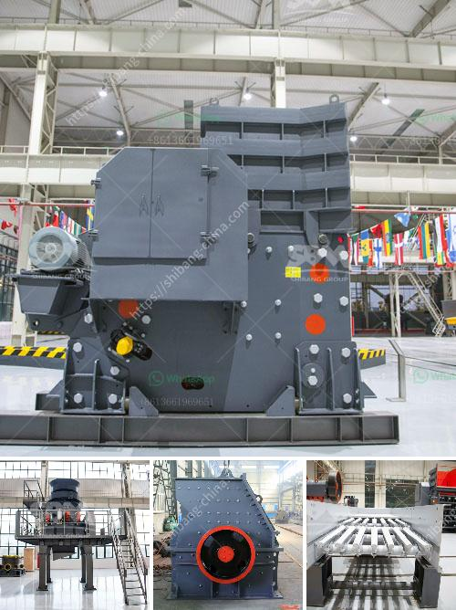

<h3>equipment equipment for mineral crushing</h3>
In the mining industry, crushing plays a pivotal role in reducing the size of ore materials to attain the desired mineral extraction. Various types of equipment are utilized in the crushing process to attain the desired crushing dimensions and thereby facilitate the extraction process. This article provides a comprehensive guide to the equipment used for mineral crushing.

Jaw crushers are commonly used for primary crushing, where larger rocks and ores need to be reduced in size. These machines are sturdy and designed to handle high-capacity crushing. They consist of a fixed jaw plate and a movable jaw plate that create a V-shaped cavity. As the material enters the cavity, it is gradually crushed until the desired size is achieved.

Cone crushers are utilized for secondary and tertiary crushing operations. They work on the principle of compression, where the material is squeezed between the eccentrically rotating mantle and the stationary concave. By cracking the material, cone crushers help to reduce the size further. They are versatile and available in various configurations to handle different types of materials efficiently.

Impact crushers operate through impact, which involves the use of hammers or blow bars to strike and break the material. These machines are particularly suitable for crushing softer materials with low abrasiveness. They offer high production rates and good reduction ratios, making them widely used in mineral processing operations.

Gyratory crushers are similar to jaw crushers in terms of their design and operation. However, gyratory crushers have a conical head that gyrates inside a larger bowl. This design allows for a higher capacity than jaw crushers and provides a more uniform particle size distribution. Gyratory crushers are often used in primary crushing applications.

Roll crushers are used for the crushing of minerals with high compressive strength. They consist of one or two rolls that rotate towards each other, crushing the material between them. The rolls can be smooth or have teeth, depending on the desired product size. Roll crushers are suitable for both primary and secondary crushing applications.

Apart from these primary crushing equipment, other secondary and tertiary crushing equipment, such as screens, conveyors, and vibrating feeders, are employed to enhance the overall efficiency of the crushing process. These support equipment help to control and optimize the flow of material throughout the crushing circuit.

Furthermore, advancements in technology have led to the development of mobile crushing plants, which enable on-site crushing. Mobile crushers can be transported to different locations, eliminating the need for multiple equipment sets and reducing transportation costs.

In conclusion, crushing equipment plays a crucial role in mineral processing operations. Various types of crushers, including jaw crushers, cone crushers, impact crushers, gyratory crushers, and roll crushers, are used to reduce the size of ore materials. Other supporting equipment, such as screens, conveyors, and vibrating feeders, further enhance the efficiency of the crushing process. With advancements in technology, mobile crushing plants have become popular, providing on-site crushing capabilities. Understanding the various types of equipment available ensures efficient and effective mineral crushing.
<h3>Contact us</h3><ul><li><strong>Whatsapp:&nbsp;<a href="https://wa.me/8613661969651">+8613661969651</a></strong></li><li><a href="https://swt.shibang-china.com/?git&amp;zhl&amp;equipment equipment for mineral crushing"><strong>Online Service(chat now)</strong></a></li></ul><h3>Related</h3><ul><li><a href='i want to buy a quarry machine nigeria.md'>i want to buy a quarry machine nigeria</a></li><li><a href='baxter stone crusher in uk.md'>baxter stone crusher in uk</a></li><li><a href='mobile crusher line.md'>mobile crusher line</a></li><li><a href='coal milling machine.md'>coal milling machine</a></li><li><a href='specification jaw crusher.md'>specification jaw crusher</a></li></ul>