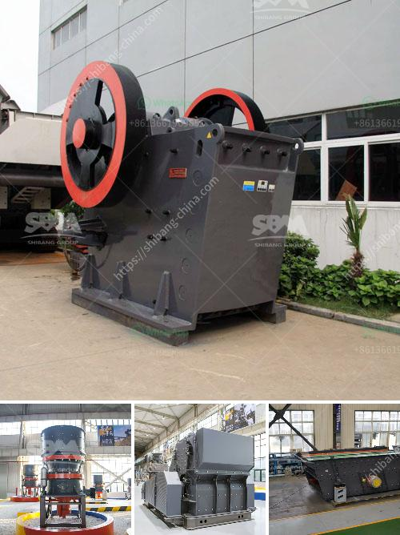

<h3>equipment for crushing gravel</h3>
Equipment for crushing gravel is essential for a variety of construction projects, as it helps break down and shape the material into manageable pieces. Gravel is commonly used in foundations, roads, and landscaping, and it is an excellent choice for low-maintenance and durable surfaces. To achieve the desired results, selecting the right equipment for crushing gravel is crucial. Here, we will discuss some of the commonly used and effective machines for this purpose.

One of the primary machines used for crushing gravel is the jaw crusher. This machine uses mechanical pressure to break up larger rocks into smaller pieces. It has two jaws - one fixed and one moving. The fixed jaw is positioned vertically, while the moving jaw exerts force against the fixed jaw, crushing the gravel in a controlled motion. The jaw crusher is versatile and can be used for various sizes and types of gravel.

Another popular choice for gravel crushing is the cone crusher. Similar to the jaw crusher, it operates by crushing the material between a stationary bowl liner and a rotating mantle. Cone crushers are known for their efficiency and high production rates, making them ideal for gravel crushing. They are also used in the mining industry for ore processing.

For finer gravel, impact crushers are suitable. These machines use a high-speed rotor with hammers that impact the material, causing it to break into smaller pieces. Impact crushers are commonly used in quarrying and recycling applications, as they create a uniform and quality product.

In addition to crushers, screens are often used in gravel crushing operations. A screen separates fine particles from larger ones, ensuring a consistent size and quality of the crushed gravel. Screens can be vibrating or non-vibrating, and they come in various sizes and configurations to suit specific project requirements.

To enhance efficiency and productivity, many crushing and screening plants use conveyors to transport the gravel. Conveyors eliminate the need for manual handling and can transport the material to different areas of the site. They are suitable for both indoor and outdoor settings and can be customized to meet specific project needs.

When selecting equipment for crushing gravel, it is important to consider factors such as the type and size of the gravel, the required product quality, the production rate, and the specific project requirements. Each machine has unique features and capabilities, and understanding these aspects will help in making the right choice.

In conclusion, the right equipment for crushing gravel is vital for achieving efficient and high-quality results in construction projects. Jaw crushers, cone crushers, and impact crushers are commonly used machines for gravel crushing. Screens and conveyors are often employed to optimize productivity and ensure the desired product specifications. By considering the specific project requirements, one can select the appropriate equipment for crushing gravel and achieve optimal results.
<h3>Contact us</h3><ul><li><strong>Whatsapp:&nbsp;<a href="https://wa.me/8613661969651">+8613661969651</a></strong></li><li><a href="https://swt.shibang-china.com/?git&amp;zhl&amp;equipment for crushing gravel"><strong>Online Service(chat now)</strong></a></li></ul><h3>Related</h3><ul><li><a href='silica sand processing equipment.md'>silica sand processing equipment</a></li><li><a href='roller raymond mill with best price.md'>roller raymond mill with best price</a></li><li><a href='hammer milling disadvantages.md'>hammer milling disadvantages</a></li><li><a href='type of stone crushers.md'>type of stone crushers</a></li><li><a href='stone crushing plant project report.md'>stone crushing plant project report</a></li></ul>