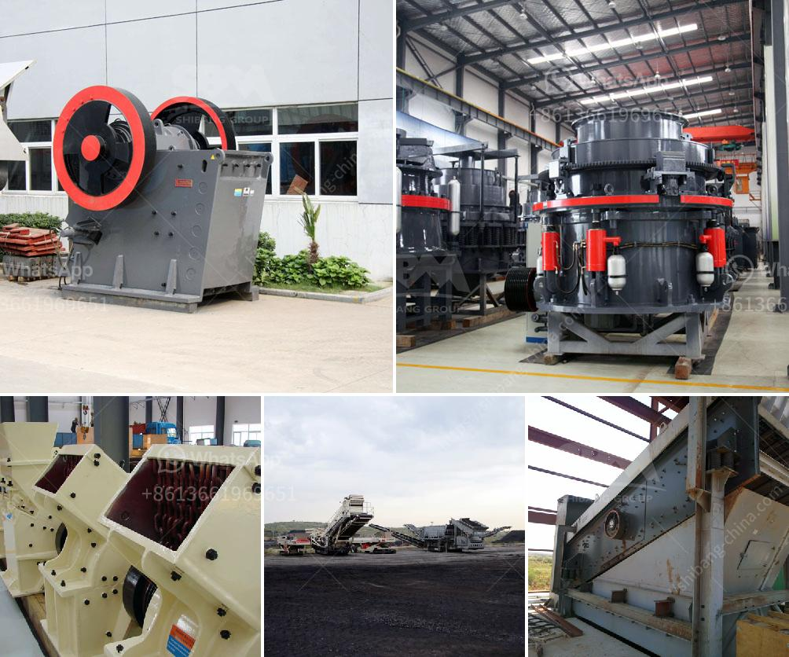

<h3>equipment for ferro manganese plant</h3>
Ferro manganese plays a crucial role in the steel industry, as it is used for alloying steel and enhancing its properties. To ensure efficient production of high-quality ferro manganese, a well-equipped plant is necessary. In this article, we will discuss the essential equipment required for a ferro manganese plant.

1. Furnace: The heart of any ferro manganese plant is its furnace. The furnace is responsible for smelting manganese ore, along with carbon or silicon, to produce ferro manganese. Different types of furnaces, such as electric arc furnaces or blast furnaces with hot-blast stoves, can be used depending on the production capacity and the quality of ferro manganese desired.

2. Ore Processing Equipment: Manganese ore needs to be processed before it can be used in the furnace. Various equipment, such as crushers, screens, and conveyors, are used for ore processing. These equipment not only crush and screen the ore but also remove impurities and improve the ore's quality before it enters the furnace.

3. Carbon or Silicon Feeding System: Carbon or silicon is essential for the smelting process in the furnace. A feeding system, comprising hoppers, feeders, and conveyors, is required to deliver the carbon or silicon materials to the furnace. These systems ensure a controlled and precise feed rate for achieving consistent and efficient smelting.

4. Alloy Mixing System: Ferro manganese is often alloyed with other metals to achieve specific steel properties. An alloy mixing system, consisting of weigh hoppers, mixers, and conveyors, is employed to blend the ferro manganese with other alloying elements. This system ensures homogeneity and accurate composition of the final alloy.

5. Waste Gas Treatment System: During the smelting process, waste gases are generated that contain harmful substances. A waste gas treatment system, including dust collectors, gas scrubbers, and bag filters, is employed to remove particulate matter, sulfur dioxide, and other contaminants from the waste gas before it is released into the atmosphere.

These are just a few examples of the essential equipment required for a ferro manganese plant. Additionally, other equipment, such as material handling systems, cooling systems, and power supply systems, are also necessary for smooth plant operations.

In conclusion, the proper selection and utilization of equipment in a ferro manganese plant is crucial to ensure efficient and high-quality production. Investing in reliable and advanced equipment not only enhances production capacity but also minimizes downtime and maintenance costs. With the right equipment, a ferro manganese plant can meet the growing demand for this vital alloy in the steel industry.
<h3>Contact us</h3><ul><li><strong>Whatsapp:&nbsp;<a href="https://wa.me/8613661969651">+8613661969651</a></strong></li><li><a href="https://swt.shibang-china.com/?git&amp;zhl&amp;equipment for ferro manganese plant"><strong>Online Service(chat now)</strong></a></li></ul><h3>Related</h3><ul><li><a href='cost o gypsum processing machines.md'>cost o gypsum processing machines</a></li><li><a href='ballast ore crusher for sale in kenya.md'>ballast ore crusher for sale in kenya</a></li><li><a href='manufacturer of crushing equipment philippines.md'>manufacturer of crushing equipment philippines</a></li><li><a href='milling processing for small scale mining.md'>milling processing for small scale mining</a></li><li><a href='alluvial diamond processing plant container for sale.md'>alluvial diamond processing plant container for sale</a></li></ul>