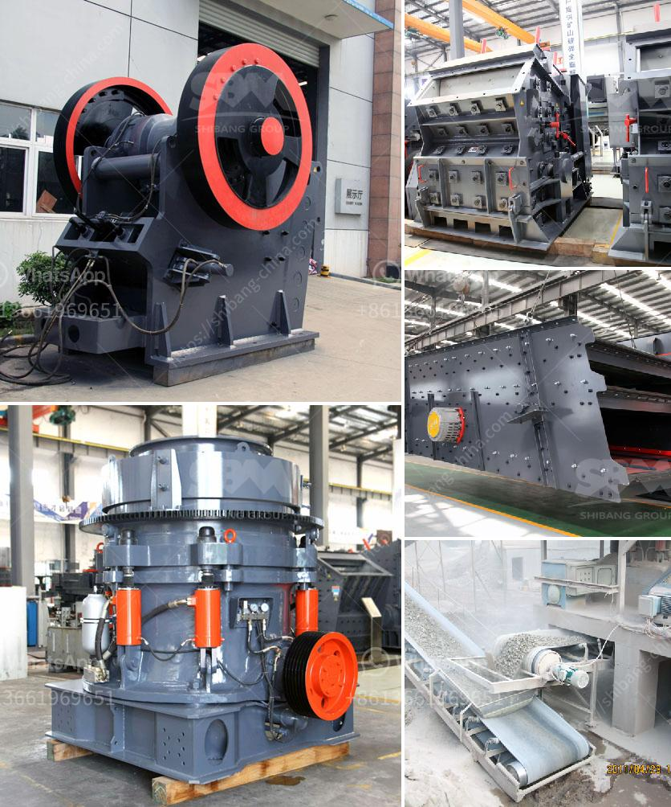

<h3>equipment for limestone mine</h3>
Limestone is a prevalent rock type across the globe, accounting for approximately 15% of all sedimentary rocks. It is primarily composed of calcium carbonate, but also contains other minerals such as silica, clay, pyrite, iron oxide, and graphite. Formed over millions of years, limestone is highly valued for its numerous applications in various industries, including construction, agriculture, and manufacturing.

When mining limestone, several pieces of equipment are typically used to extract the mineral. These include the following:

1. Mining Drills: As the name suggests, mining drills are used to bore into the earth's crust to reach the limestone deposit. It is essential to drill precise and designated holes to ensure the efficiency of subsequent blasting operations. Mining drills must be robust and capable of penetrating hard limestone formations without wear or mechanical failure.

2. Blasting Equipment: After drilling, controlled explosives are inserted into the holes created by mining drills. Blasting equipment plays a crucial role in fragmenting and dislodging the limestone, making it easier to remove and transport. The process requires careful planning and adherence to safety protocols to minimize environmental impact and ensure the safety of the workers.

3. Bulldozers and Excavators: Once blasted, the limestone must be excavated and loaded onto vehicles for transportation. Bulldozers and excavators are commonly used in this phase of the mining operation. Bulldozers are ideal for pushing loose rocks and debris, while excavators can efficiently load the excavated limestone onto trucks or conveyor belts.

4. Haul Trucks: The transportation of extracted limestone from the mine to processing plants or storage sites requires the use of haul trucks. These are heavy-duty vehicles designed to transport heavy loads over long distances. In limestone mining, haul trucks may carry several tons of material at once, contributing to the overall efficiency of the operation.

5. Crushing and Screening Equipment: After hauling, the limestone is then crushed and screened to the appropriate size for various applications. Crushing equipment breaks down large rocks into smaller, more manageable pieces, while screening equipment separates the crushed limestone into various grades. This equipment is crucial in ensuring the quality and consistency of the end product.

6. Conveyor Systems: To optimize the flow of limestone within the mine and streamline the extraction process, conveyor systems are typically utilized. These systems transport limestone from one stage of the mining operation to the next, reducing manual labor and improving overall efficiency.

7. Dust Control Systems: Limestone mining generates a significant amount of dust due to the mechanical processes involved. Dust control systems, such as dust collectors or sprayers, are used to minimize airborne particles and maintain air quality within the mine. Implementing effective dust control measures is not only vital for worker safety but also helps to prevent environmental pollution.

In conclusion, the equipment used in a limestone mine plays a significant role in extracting and processing the mineral. From drilling and blasting to crushing and screening, each piece of equipment contributes to the overall efficiency and productivity of the operation. Employing modern and well-maintained equipment ensures faster and safer extraction, ultimately leading to a more sustainable limestone mining industry.
<h3>Contact us</h3><ul><li><strong>Whatsapp:&nbsp;<a href="https://wa.me/8613661969651">+8613661969651</a></strong></li><li><a href="https://swt.shibang-china.com/?git&amp;zhl&amp;equipment for limestone mine"><strong>Online Service(chat now)</strong></a></li></ul><h3>Related</h3><ul><li><a href='marble powder plant.md'>marble powder plant</a></li><li><a href='sewa rental stone crusher.md'>sewa rental stone crusher</a></li><li><a href='benefits of vsi crusher.md'>benefits of vsi crusher</a></li><li><a href='components of the hammer crusher.md'>components of the hammer crusher</a></li><li><a href='quote conical vertical impact crusher.md'>quote conical vertical impact crusher</a></li></ul>