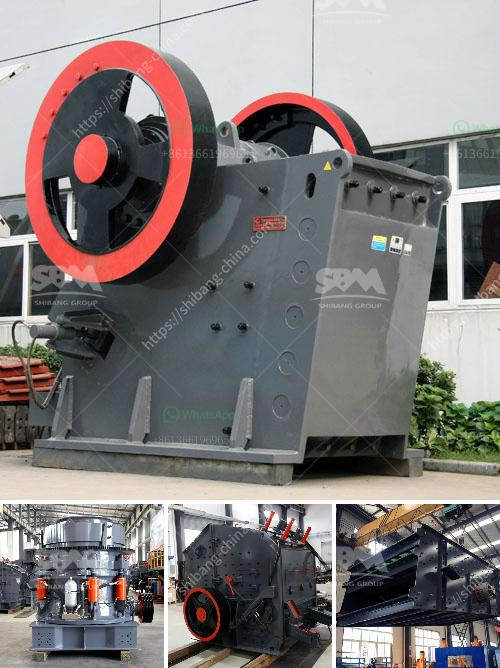

<h3>equipment for quarry</h3>
Quarries are essential for extracting valuable materials such as stone, limestone, and gravel. These materials are utilized across various industries for construction, manufacturing, and landscaping purposes. To ensure a successful quarry operation, it is crucial to have the right equipment that efficiently extracts and processes materials. In this article, we will explore the essential equipment used in quarry operations and how they play a role in boosting efficiency and productivity.

First and foremost, a heavy-duty excavator is a fundamental piece of equipment in any quarry. These powerful machines are used for digging and excavating in the quarry pit, removing overburden, and loading materials onto dump trucks. Excavators can handle large volumes of material quickly and efficiently, reducing the time required for quarrying operations. Moreover, their versatility allows them to work in various terrains and handle different types of materials.

Another indispensable piece of equipment for quarry operations is a wheel loader. These machines are commonly used for transporting materials around the quarry site. With their ability to scoop and carry large quantities of materials, wheel loaders play a crucial role in the efficient movement of materials from the quarry face to the processing area. By minimizing manual handling and reducing the time required for material transportation, wheel loaders significantly enhance operational efficiency.

To extract materials from the quarry face, drilling equipment is required. Drill rigs equipped with hydraulic or pneumatic hammer drills are commonly used to create holes and fractures in the rock. These holes are crucial for placing explosives, which break apart the rock for further processing. Modern drill rigs are highly efficient, capable of drilling multiple holes in a single operation, thereby maximizing productivity.

Once the rock has been extracted, it needs to be crushed and processed into the desired sizes for various applications. Crushers and screens are vital equipment in this stage of the quarrying process. Crushers are used to break down large rocks into smaller, more manageable sizes, while screens are used to separate the crushed materials into different gradations. Both crushers and screens are designed to handle different types of materials and can operate efficiently in various conditions, enhancing the overall productivity of the quarry operation.

Transportation of materials is another critical aspect of quarry operations. To efficiently move materials from the processing area to storage or shipment points, conveyors are widely used. Conveyors eliminate the need for manual handling and can transport large volumes of materials over long distances. They are highly versatile and can be customized to fit specific site requirements, making them an integral part of enhancing efficiency and productivity in quarry operations.

In conclusion, the right equipment is essential for boosting efficiency and productivity in quarry operations. From heavy-duty excavators and wheel loaders to drill rigs, crushers, screens, and conveyors, each piece of equipment plays a crucial role in the extraction, processing, and transportation of materials. By investing in modern and efficient equipment, quarry operators can maximize their output, minimize operational costs, and ensure a sustainable and profitable quarrying operation.
<h3>Contact us</h3><ul><li><strong>Whatsapp:&nbsp;<a href="https://wa.me/8613661969651">+8613661969651</a></strong></li><li><a href="https://swt.shibang-china.com/?git&amp;zhl&amp;equipment for quarry"><strong>Online Service(chat now)</strong></a></li></ul><h3>Related</h3><ul><li><a href='vertical ball mills.md'>vertical ball mills</a></li><li><a href='stone equipment hammer mill philippines.md'>stone equipment hammer mill philippines</a></li><li><a href='chromite ore processing in zimbabwe.md'>chromite ore processing in zimbabwe</a></li><li><a href='quartz crusher prices.md'>quartz crusher prices</a></li><li><a href='roller mill famsun.md'>roller mill famsun</a></li></ul>