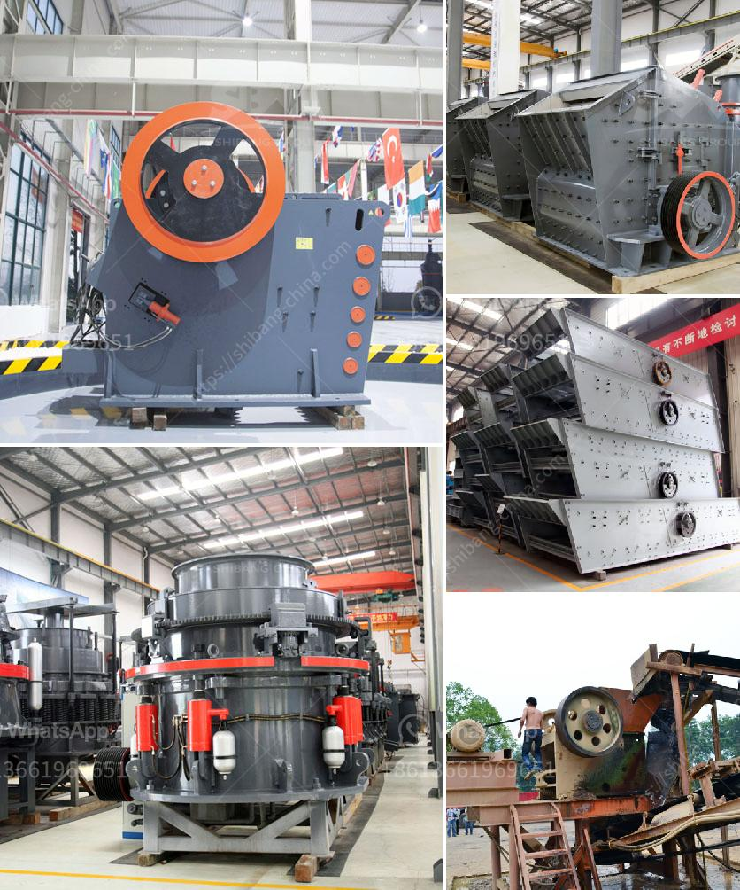

<h3>equipment required for the work of granite quarry</h3>
Granite is a type of igneous rock that is formed from the slow crystallization of magma beneath the Earth's surface. It has become a popular choice for construction and decorative purposes due to its durability and aesthetic appeal. Granite quarries are the primary source of this valuable stone, and they require a range of equipment to extract, process, and transport it efficiently. In this article, we will explore the equipment required for the work of a granite quarry.

1. Excavators: Excavators are heavy-duty machines used in various stages of the granite quarrying process. They are equipped with large buckets or hydraulic attachments, such as rock breakers, which help in the excavation of granite blocks from the quarry walls. Excavators play a crucial role in ensuring the smooth and efficient extraction of granite.

2. Crushers: Once the granite blocks have been excavated, they need to be processed to the desired size for different applications. Crushers are used for this purpose. They come in various types, such as jaw crushers, cone crushers, and impact crushers. These machines break down the large granite blocks into smaller pieces that can be further processed or sold as is.

3. Diamond Wire Saws: Diamond wire saws are used in granite quarries to cut through the hard rock smoothly and accurately. They consist of a thin wire embedded with industrial-grade diamonds. The wire is threaded through a series of pulleys and connected to a power source. Diamond wire saws provide an efficient and precise solution for cutting large blocks of granite.

4. Wheel Loaders: Wheel loaders, also known as front-end loaders, are essential equipment in granite quarries. They are used for loading and transporting the extracted granite blocks to different processing areas within the quarry. Wheel loaders have a bucket attachment at the front that can handle large volumes of materials efficiently.

5. Polishing Machines: Polished granite is widely used in countertops, flooring, and other decorative applications. Polishing machines are used to achieve the desired shine and smoothness on the granite surface. These machines utilize various abrasive pads and grinding discs to grind and polish the granite, resulting in a glossy finish.

6. Dump Trucks: Dump trucks are used for the transportation of granite blocks and processed granite from the quarry to different distribution points. They have large capacity beds that can carry heavy loads safely. Dump trucks play a crucial role in ensuring the efficient and timely delivery of granite products.

7. Water Recycling Systems: Granite quarrying requires a significant amount of water for various purposes, such as dust suppression, equipment cooling, and stone cutting. Water recycling systems are employed to reduce water consumption and minimize environmental impact. These systems capture and treat the water used in quarry operations, allowing it to be reused, promoting sustainability.

In conclusion, the work of a granite quarry requires a wide range of equipment to extract, process, and transport the granite efficiently. Excavators, crushers, diamond wire saws, wheel loaders, polishing machines, dump trucks, and water recycling systems are crucial in ensuring the smooth operation of a granite quarry. These machines and systems not only facilitate the extraction and processing of granite but also promote sustainability by minimizing water consumption and reducing waste.
<h3>Contact us</h3><ul><li><strong>Whatsapp:&nbsp;<a href="https://wa.me/8613661969651">+8613661969651</a></strong></li><li><a href="https://swt.shibang-china.com/?git&amp;zhl&amp;equipment required for the work of granite quarry"><strong>Online Service(chat now)</strong></a></li></ul><h3>Related</h3><ul><li><a href='roller raymond mill with best price.md'>roller raymond mill with best price</a></li><li><a href='how much do rock crushers cost.md'>how much do rock crushers cost</a></li><li><a href='jaw crusher discount.md'>jaw crusher discount</a></li><li><a href='ultra fine grinding mills.md'>ultra fine grinding mills</a></li><li><a href='crushing and screening plant.md'>crushing and screening plant</a></li></ul>