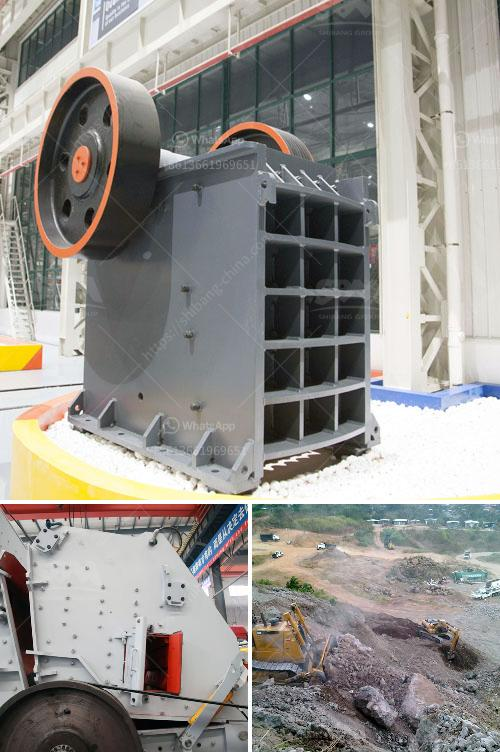

<h3>equipment used in limestone mining</h3>
Limestone is a sedimentary rock composed mostly of calcium carbonate (CaCO3). It is formed by the accumulation of shells, skeletons, and other hard fragments of marine organisms over millions of years. Limestone mining is carried out through open-pit and underground methods, mainly involving blasting and excavation. In this article, we will discuss the equipment used in various stages of limestone mining.

1. Drilling and blasting: The first step in limestone mining is to conduct drilling and blasting operations. This is done to expose the limestone deposit and prepare it for excavation. In this process, a series of holes are drilled into the rock face using specialized drilling equipment. The size and spacing of the holes depend on the desired size of the fragmented material. After drilling, explosives are inserted into the holes and detonated, breaking the limestone into smaller pieces.

2. Excavation: Once the limestone is fragmented, it is excavated using heavy machinery. The type of equipment used depends on the scale of the mining operation. For large-scale open-pit mining, front-end loaders, bulldozers, and haul trucks are used to remove overburden (the layers of soil and rock covering the limestone deposit) and extract the limestone. These machines are capable of moving large amounts of material efficiently.

3. Crushing and screening: After the limestone is excavated, it is transported to a crushing plant. Here the limestone is crushed and screened to produce various sizes of crushed stone products, such as limestone grits, limestone fines, limestone chippings, and limestone dust. This process helps to separate the different grades and remove any impurities from the limestone.

4. Washing and classification: Once the limestone is crushed, it may go through a washing process to remove impurities and improve its quality. This is especially important for applications where purity is crucial, such as in the production of high-quality concrete and asphalt. The crushed limestone may also be classified into different particle sizes using screens or classifiers.

5. Grinding and milling: Limestone may also undergo further processing to produce limestone powder, which is used as a filler material in various industries. Grinding mills are used to crush and grind the limestone into fine particles. These particles can then be used in a wide range of applications, such as construction materials, fertilizers, and industrial chemicals.

6. Environmental controls: Mining operations in limestone quarries often have significant environmental impacts. To mitigate these impacts, various environmental controls are implemented. These may include dust suppression systems to reduce dust emissions, water management systems to control water runoff and reduce the risk of contamination, and rehabilitation plans to restore the site after mining has ceased.

In conclusion, limestone mining involves several stages, from drilling and blasting to crushing, screening, and processing. Each stage requires specific equipment to achieve efficient and safe operations. The type of equipment used may vary depending on the scale of the mining operation and the desired final product. Environmental controls are also important to mitigate the negative impacts of mining on the environment. Overall, limestone mining plays a vital role in various industries and requires specialized equipment for effective and sustainable extraction.
<h3>Contact us</h3><ul><li><strong>Whatsapp:&nbsp;<a href="https://wa.me/8613661969651">+8613661969651</a></strong></li><li><a href="https://swt.shibang-china.com/?git&amp;zhl&amp;equipment used in limestone mining"><strong>Online Service(chat now)</strong></a></li></ul><h3>Related</h3><ul><li><a href='fine grinding mills.md'>fine grinding mills</a></li><li><a href='mobile gold processing plant in russia.md'>mobile gold processing plant in russia</a></li><li><a href='mining industry in mpumalanga.md'>mining industry in mpumalanga</a></li><li><a href='grinding machine palletsgrinding machine palvisor.md'>grinding machine palletsgrinding machine palvisor</a></li><li><a href='ceramic crusher machine.md'>ceramic crusher machine</a></li></ul>