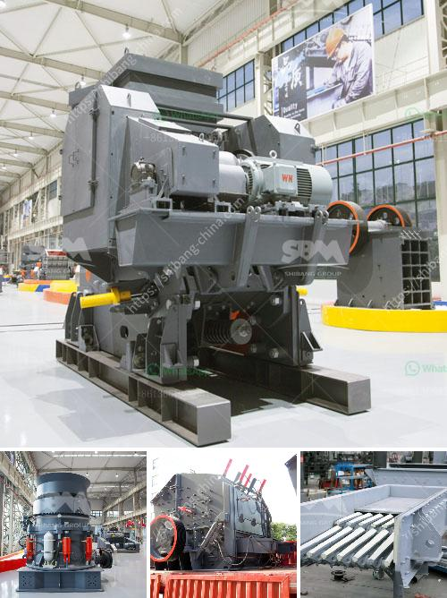

<h3>ethiopia with crusher for sale</h3>
Ethiopia, a landlocked country situated in the Horn of Africa, has been undergoing significant economic growth in recent years. The rapid expansion of infrastructure projects, including roads, bridges, and buildings, has created a surge in demand for construction materials, particularly aggregates. As a result, the crusher industry is experiencing a boom, offering lucrative opportunities for both buyers and sellers. In this article, we will explore the crusher market in Ethiopia and highlight available options for those seeking crushers for sale.

Ethiopia's infrastructure development is fueled by a strong government commitment to tackling poverty and boosting economic growth. To achieve these goals, the government has invested heavily in constructing roads, dams, and public buildings. These projects require considerable amounts of aggregate materials, creating an ever-increasing demand for crushers.

Crushers are machines designed to break down large rocks into smaller ones, making them suitable for construction purposes. Different types of crushers are available in the market, each serving specific needs and offering unique advantages. Some popular crusher options include:

1. Jaw Crushers: This type of crusher is commonly used for primary crushing and works by compressing rock between two hard surfaces. Jaw crushers are reliable and offer low operating costs, making them ideal for construction sites with limited budgets.

2. Cone Crushers: Often used for secondary or tertiary crushing, cone crushers are versatile machines that deliver high-quality products. They operate by squeezing rock between an eccentrically rotating mantle and a concave surface.

3. Impact Crushers: Impact crushers utilize rapid impact forces to crush stones. They are suitable for various materials, including concrete and asphalt, and provide excellent cubicity and shape for high-quality aggregates.

4. Mobile Crushers: In a country like Ethiopia, where infrastructure projects are scattered across vast distances, mobile crushers offer unparalleled convenience. They can be easily transported and set up at multiple sites, allowing for flexible operations and maximum productivity.

For entrepreneurs looking for profitable business opportunities, investing in crushers can yield several advantages. Firstly, Ethiopia's fast-growing infrastructure sector ensures a consistent demand for construction materials, ensuring a stable market for crushers. Moreover, crusher manufacturing is not yet well-established within the country, resulting in a scarcity of crushers in the market. This scarcity drives up the prices, making it a lucrative market for sellers.

Ethiopia's robust infrastructure development, coupled with the growing demand for construction materials, presents a promising business opportunity in the crusher market. Entrepreneurs looking to invest in crushers can tap into this rising demand and contribute to the country's economic growth. It is crucial, however, to carefully evaluate available options considering factors such as price, suitability, and after-sales service. As the crusher market in Ethiopia continues to flourish, buyers and sellers can unlock tremendous potential by capitalizing on this growth.
<h3>Contact us</h3><ul><li><strong>Whatsapp:&nbsp;<a href="https://wa.me/8613661969651">+8613661969651</a></strong></li><li><a href="https://swt.shibang-china.com/?git&amp;zhl&amp;ethiopia with crusher for sale"><strong>Online Service(chat now)</strong></a></li></ul><h3>Related</h3><ul><li><a href='alluvial chrome wash plant in zimbabwe.md'>alluvial chrome wash plant in zimbabwe</a></li><li><a href='egypt aggregate stone for concrete prices.md'>egypt aggregate stone for concrete prices</a></li><li><a href='sand washing screening machine.md'>sand washing screening machine</a></li><li><a href='quarry crusher equipments and machinery.md'>quarry crusher equipments and machinery</a></li><li><a href='price of raymond used for crushing the powder stones.md'>price of raymond used for crushing the powder stones</a></li></ul>