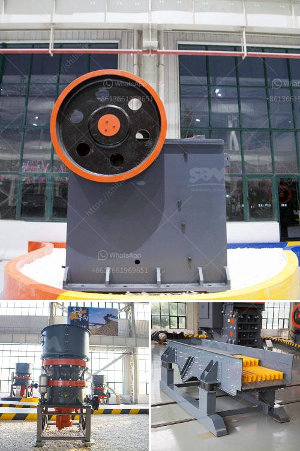

<h3>europe quartz stone machinery factory</h3>
Europe has a long-standing reputation for being at the forefront of technological innovation, and the quartz stone machinery industry is no exception. With its rich history in manufacturing and engineering, Europe has become a hub for state-of-the-art quartz stone machinery factories that manufacture cutting-edge equipment for the global market.

One such factory, based in Europe, has emerged as a leader in the production of quartz stone machinery. This factory, equipped with the latest technologies and highly skilled workforce, is revolutionizing the way quartz stone is processed, reducing costs, and improving efficiency.

The factory boasts an impressive range of machinery, including cutting machines, polishing machines, and precision tools that streamline the quartz stone manufacturing process. These cutting-edge machines are not only designed for high precision, but they also ensure high production rates, allowing manufacturers to meet the increasing demand for quartz stone.

What sets this factory apart from others is its focus on research and development. The factory invests a significant amount of resources in developing new and improved machinery, constantly pushing the boundaries of innovation in the industry. This commitment to R&D enables them to stay ahead of their competitors and offer cutting-edge solutions to their clients.

One of the most significant breakthroughs from this factory is the development of automated machinery. These machines have significantly reduced the need for manual labor, making the manufacturing process faster, more efficient, and cost-effective. Automation also reduces human error, ensuring consistent quality in the produced quartz stone.

In addition to automation, the factory also prioritizes environmental sustainability. They have incorporated eco-friendly practices in their manufacturing process, such as using energy-efficient machinery and recycling water. This not only helps in reducing their carbon footprint but also meets the growing demand for environmentally responsible products.

The factory's commitment to quality is evident in every aspect of their production. They source the highest quality materials and use the latest technology to ensure that the quartz stone machinery they manufacture is both durable and efficient. Their rigorous quality control measures guarantee that each machine leaving the factory meets the highest industry standards.

Moreover, their dedication to customer satisfaction is unmatched. The factory provides comprehensive after-sales support, including installation, training, and maintenance services. Their highly skilled technicians are available to address any issues or concerns that their clients may have, ensuring a seamless experience from start to finish.

As a result of their relentless pursuit of excellence, the factory has earned an esteemed reputation in the global quartz stone machinery market. Clients from around the world trust their machinery for its superior quality, durability, and performance.

The Europe Quartz Stone Machinery Factory epitomizes the continent's commitment to technological advancement. Through continuous innovation, automation, and sustainability, this factory is revolutionizing the quartz stone machinery industry. With their cutting-edge machinery and unwavering dedication to customer satisfaction, they are well-positioned to lead the way in the future of quartz stone manufacturing.
<h3>Contact us</h3><ul><li><strong>Whatsapp:&nbsp;<a href="https://wa.me/8613661969651">+8613661969651</a></strong></li><li><a href="https://swt.shibang-china.com/?git&amp;zhl&amp;europe quartz stone machinery factory"><strong>Online Service(chat now)</strong></a></li></ul><h3>Related</h3><ul><li><a href='jaw crusher manufacturer in china.md'>jaw crusher manufacturer in china</a></li><li><a href='limestone gypsum crusher machine.md'>limestone gypsum crusher machine</a></li><li><a href='crushing of coal process.md'>crushing of coal process</a></li><li><a href='manufacturer jaw crusher.md'>manufacturer jaw crusher</a></li><li><a href='100 tph stone crusher plant specifications.md'>100 tph stone crusher plant specifications</a></li></ul>