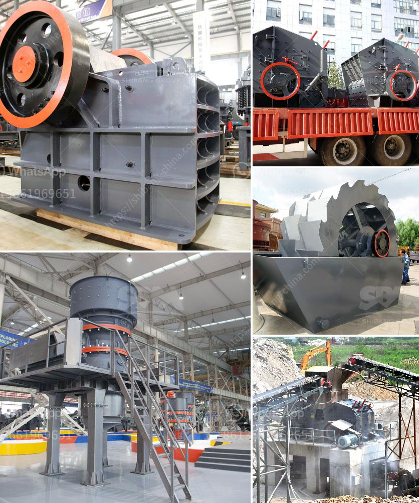

<h3>europe stone quarry equipment supplier</h3>
Europe is not only known for its rich cultural heritage and breathtaking landscapes but also for its thriving stone quarrying industry. Stone quarrying has been an essential part of European civilization for centuries, supplying materials for construction, sculpture, and various architectural purposes.

One crucial aspect of this industry is the equipment used to extract and process the stones efficiently. European stone quarry equipment suppliers play a vital role in ensuring that the industry remains sustainable and economically viable.

These suppliers offer a wide range of high-quality equipment, including diamond wire saws, diamond tools, drilling machines, and excavators, which are specifically designed for stone quarrying operations. These machines are equipped with advanced technologies to enhance productivity, minimize environmental impact, and ensure worker safety.

Moreover, European stone quarry equipment suppliers are committed to providing comprehensive services to their customers. They assist in the selection of appropriate equipment based on the specific requirements of the quarry operations. Additionally, they offer installation, training, and maintenance services, ensuring optimal performance and longevity of the equipment.

One of the major advantages of sourcing stone quarry equipment from European suppliers is their adherence to strict quality standards. European countries have established rigorous regulations to ensure that the equipment meets safety and environmental requirements. By choosing equipment from reputable suppliers, quarry operators can rest assured that they are investing in reliable, durable, and sustainable machinery.

Furthermore, European stone quarry equipment suppliers continually strive to innovate and improve their products. They invest in research and development to enhance the performance and efficiency of their machines. This commitment to innovation enables quarry operators to stay ahead in a highly competitive market and meet evolving customer demands.

In conclusion, European stone quarry equipment suppliers play a crucial role in the sustainable development of the stone quarrying industry. By offering high-quality, innovative equipment and comprehensive services, they contribute to the efficiency, safety, and profitability of quarry operations. Quarry operators can rely on these suppliers to provide equipment that meets strict quality standards, ensuring long-term success in this flourishing industry.
<h3>Contact us</h3><ul><li><strong>Whatsapp:&nbsp;<a href="https://wa.me/8613661969651">+8613661969651</a></strong></li><li><a href="https://swt.shibang-china.com/?git&amp;zhl&amp;europe stone quarry equipment supplier"><strong>Online Service(chat now)</strong></a></li></ul><h3>Related</h3><ul><li><a href='used classifiers for sale from alpine.md'>used classifiers for sale from alpine</a></li><li><a href='equipment required for the work of granite quarry.md'>equipment required for the work of granite quarry</a></li><li><a href='hammer mill machine price.md'>hammer mill machine price</a></li><li><a href='slag powder grinding in india.md'>slag powder grinding in india</a></li><li><a href='prices of stone crushers in philippines.md'>prices of stone crushers in philippines</a></li></ul>