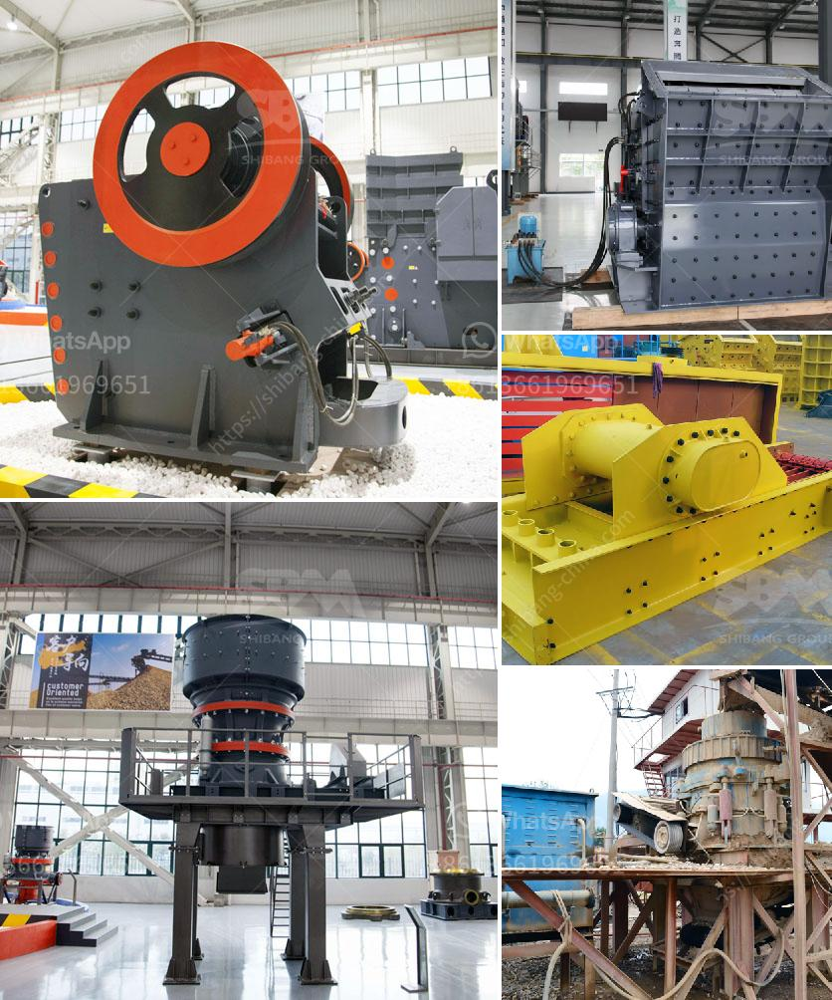

<h3>europe used grinding equipment</h3>
Grinding equipment plays a crucial role in the manufacturing industry, where precision and efficiency are of utmost importance. In Europe, a robust market for used grinding equipment has emerged, providing manufacturers with cost-effective solutions to meet their specific needs. With a wide range of products and a focus on technology, Europe has become a hub for the sale and resale of high-quality used grinding equipment.

One of the key advantages of buying used grinding equipment in Europe is cost savings. The initial investment required to purchase new grinding equipment can be significant, especially for small and medium-sized enterprises. By opting for used equipment, manufacturers can access the required machinery at a fraction of the price without compromising quality. This allows them to allocate their financial resources more effectively and invest in other areas of their operations, such as research and development or marketing.

Europe is known for its advanced technology and high-quality manufacturing standards, making it an ideal market for used grinding equipment. Owing to stringent regulations and quality control measures, European manufacturers ensure that their equipment is well-maintained and in excellent working condition. Many European countries have a tradition of skilled craftsmanship, and this expertise filters into the maintenance and refurbishment of used grinding equipment. As a result, buyers can purchase reliable and well-maintained machinery that will serve their operational needs for years to come.

A wide range of used grinding equipment is available in Europe, catering to diverse manufacturing requirements. Whether it is surface grinding, cylindrical grinding, or tool and cutter grinding, buyers can find the right equipment to suit their specific needs. European manufacturers are known for their ability to customize machinery according to customer requirements, ensuring a perfect fit for individual manufacturing processes. This versatility provides buyers with a wide range of options to choose from, enabling them to select the equipment that best aligns with their manufacturing goals.

In addition to cost savings and customization options, buying used grinding equipment in Europe also ensures quick delivery and installation. European manufacturers and dealers have extensive networks, allowing them to source and supply machinery promptly. This is especially advantageous to manufacturing companies that may face time constraints or have urgent production needs. By purchasing used equipment, they can avoid extended lead times associated with ordering brand-new machinery directly from the manufacturer.

Overall, the market for used grinding equipment in Europe offers manufacturers a practical and cost-effective solution for their grinding needs. The combination of affordability, quality, customization, and prompt delivery makes Europe an attractive destination for buyers seeking reliable machines. As the manufacturing industry continues to grow and evolve, the demand for used grinding equipment is expected to further increase in Europe, providing manufacturers with sustainable and efficient solutions for the foreseeable future.
<h3>Contact us</h3><ul><li><strong>Whatsapp:&nbsp;<a href="https://wa.me/8613661969651">+8613661969651</a></strong></li><li><a href="https://swt.shibang-china.com/?git&amp;zhl&amp;europe used grinding equipment"><strong>Online Service(chat now)</strong></a></li></ul><h3>Related</h3><ul><li><a href='used classifiers for sale from alpine.md'>used classifiers for sale from alpine</a></li><li><a href='cement grinding ball mill process.md'>cement grinding ball mill process</a></li><li><a href='stone quarry companies in ghana.md'>stone quarry companies in ghana</a></li><li><a href='ethiopia with crusher for sale.md'>ethiopia with crusher for sale</a></li><li><a href='magnesite processing plant.md'>magnesite processing plant</a></li></ul>