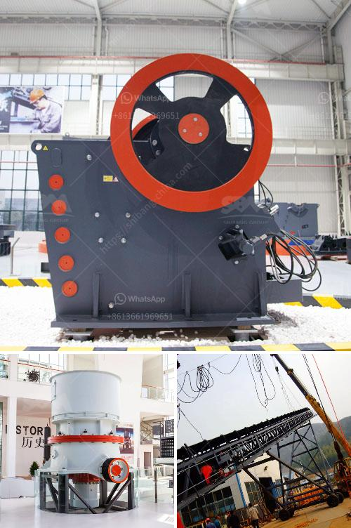

<h3>factory price tile adhesive manufacturing plant</h3>
Are you in the construction or home renovation business and looking for cost-effective and efficient solutions for tile adhesive? Look no further, as we present to you the factory price tile adhesive manufacturing plant.

Tile adhesive is an essential component in any tiling job. It is the glue that holds the tiles firmly in place, ensuring durability and longevity. With the increasing demand for high-quality tile adhesive, it is crucial to find a manufacturing plant that offers factory prices, ensuring competitive rates for your business.

One of the significant advantages of a factory price tile adhesive manufacturing plant is the ability to produce large quantities of tile adhesive at lowered costs. With advanced technology and automated production processes, these plants can manufacture tile adhesive in bulk. This not only increases productivity but also reduces the overall production cost.

Another significant benefit of a factory price tile adhesive manufacturing plant is the assurance of quality. These plants operate under strict quality control measures, ensuring that the produced tile adhesive meets the required standards. They use high-quality raw materials and have a well-defined manufacturing process that guarantees consistency in the quality of the adhesive.

Additionally, a factory price tile adhesive manufacturing plant offers versatility in the range of adhesive available. Whether you need adhesive for ceramic, porcelain, marble, or any other type of tiles, these plants can produce a variety of adhesives to suit your specific requirements. This allows you to cater to a broader customer base and expand your business prospects.

Furthermore, these manufacturing plants emphasize sustainable and eco-friendly practices. They incorporate environmentally friendly methods and technologies to reduce waste and energy consumption during the production process. By choosing a factory price tile adhesive manufacturing plant, you not only save costs but also contribute to the preservation of the environment.

To meet the demands of the modern construction industry, a factory price tile adhesive manufacturing plant keeps up with the latest trends and advancements. They continuously invest in research and development to improve their products and create innovative adhesive solutions that cater to the evolving needs of the industry. This ensures that you are always ahead in providing high-quality tile adhesive to your customers.

In conclusion, a factory price tile adhesive manufacturing plant is the perfect solution for those in the construction or home renovation business. With the ability to produce large quantities of quality adhesive at competitive rates, these manufacturing plants provide an edge in the market. The versatility in the range of adhesive options, sustainable practices, and commitment to innovation further enhance their value. So, if you are looking for a cost-effective and efficient solution for tile adhesive, consider partnering with a factory price tile adhesive manufacturing plant. Your business will reap the benefits of reduced costs, increased productivity, and customer satisfaction.
<h3>Contact us</h3><ul><li><strong>Whatsapp:&nbsp;<a href="https://wa.me/8613661969651">+8613661969651</a></strong></li><li><a href="https://swt.shibang-china.com/?git&amp;zhl&amp;factory price tile adhesive manufacturing plant"><strong>Online Service(chat now)</strong></a></li></ul><h3>Related</h3><ul><li><a href='ball mills in autocad.md'>ball mills in autocad</a></li><li><a href='screening coal crushing plant.md'>screening coal crushing plant</a></li><li><a href='high capacity fine stone quarry crusher machine.md'>high capacity fine stone quarry crusher machine</a></li><li><a href='overland conveyor belt system cost estimates.md'>overland conveyor belt system cost estimates</a></li><li><a href='cone crusher for sale nigeria.md'>cone crusher for sale nigeria</a></li></ul>