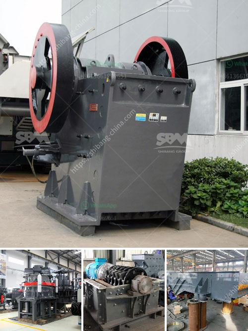

<h3>famous crusher and grinder manufacturer france</h3>
France has long been synonymous with art and sophistication. However, the nation is not just known for its cultural contributions but is also recognized as a global leader in industrial innovation. In the realm of industrial machinery, France has built a formidable reputation as the birthplace of numerous world-renowned crusher and grinder manufacturers. With a rich legacy of expertise and excellence, these manufacturers have continuously pushed the boundaries of technology, setting global standards in the process.

One cannot discuss famous crusher manufacturers in France without mentioning Roches et Carrières (Roche and Quarries). Established in 1895, this pioneering company revolutionized the construction industry through innovative crusher systems. Roche's crushers were characterized by their robust construction, high capacity, and ability to withstand demanding conditions. Their crushers became an industry benchmark, providing a blueprint for excellence that competitors worldwide aspired to replicate.

France's commitment to cutting-edge engineering extends beyond crushers to grinding solutions. Malaxeurs et Broyeurs Société Française (MBSF), a famous grinder manufacturer, has garnered international acclaim for its innovative and scientific approach to grinding. With a focus on precision and efficiency, MBSF's grinders have become indispensable in a range of industries, including pharmaceuticals, cosmetics, and food processing. MBSF's reputation is built on its ability to design custom solutions tailored to clients' specific requirements.

France's crusher and grinder manufacturers have prioritized sustainability, recognizing the need for environmentally friendly solutions. For instance, numerous manufacturers have introduced energy-efficient crushers and grinders, reducing carbon emissions and minimizing their environmental footprint. This commitment to sustainability has propelled France's manufacturers to the forefront, attracting global attention and admiration.

The innovation and quality of France's crusher and grinder industry have made its manufacturers coveted partners worldwide. French manufacturers export their cutting-edge technology and machinery to countries spanning the globe, facilitating vital infrastructure development and industrial progress. By exporting their expertise, France's manufacturers have become ambassadors for the nation's engineering prowess, forging valuable economic ties with international partners.

Over the decades, France's crusher and grinder manufacturers have continued to push the boundaries of technology and engineering. The legacy of innovation established by pioneers such as Roche and MBSF lives on, with modern manufacturers building upon these foundations. Today, these manufacturers utilize advanced materials, automation, and intelligent systems to deliver highly efficient and state-of-the-art crushers and grinders.

France's crusher and grinder manufacturers have earned global recognition for their commitment to excellence, sustainability, and technological innovation. From Roche's revolutionary crushers to MBSF's scientific approach to grinding, France's manufacturers have set the standard for the industry. Their cutting-edge machinery continues to shape and transform various sectors worldwide. As France's crusher and grinder industry thrives, it reaffirms the nation's status as a global leader in industrial engineering, ensuring that its legacy of innovation endures for generations to come.
<h3>Contact us</h3><ul><li><strong>Whatsapp:&nbsp;<a href="https://wa.me/8613661969651">+8613661969651</a></strong></li><li><a href="https://swt.shibang-china.com/?git&amp;zhl&amp;famous crusher and grinder manufacturer france"><strong>Online Service(chat now)</strong></a></li></ul><h3>Related</h3><ul><li><a href='china quarry crusher equipment.md'>china quarry crusher equipment</a></li><li><a href='100tph small capacity granite crusher.md'>100tph small capacity granite crusher</a></li><li><a href='canyon hammer mills.md'>canyon hammer mills</a></li><li><a href='cement vertical roller mill.md'>cement vertical roller mill</a></li><li><a href='process of crushing rock in aggregate.md'>process of crushing rock in aggregate</a></li></ul>