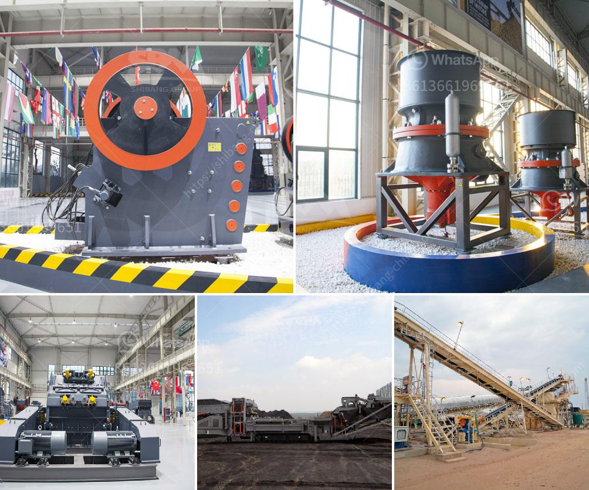

<h3>fastest gold hammer mill in china</h3>
In the realm of gold mining, the pounding of ore into smaller particles using metal hammers is a critical process. Consequently, the efficiency and speed of this operation directly affect the overall productivity and profitability of gold mining companies. China, known for its cutting-edge technology and innovative machinery, has now introduced the fastest gold hammer mill, revolutionizing the industry with its exceptional performance. Let's explore this groundbreaking advancement further.

Gold mining entails extracting precious ore from the Earth, requiring extensive processing to recover gold particles. The hammer mill plays a fundamental role in this mechanical separation process by reducing large chunks of ore into smaller, manageable fragments. Traditionally, this process involved time-consuming grinding of ore using manually operated hammers. However, the demands of today's global gold market necessitate faster and more efficient methods.

China has always been at the forefront of technological advancements, and the development of the fastest gold hammer mill is no exception. Combining cutting-edge engineering and innovative design, Chinese manufacturers have created a game-changing machine that excels in speed and performance.

The fastest gold hammer mill in China boasts unprecedented speed, capable of pulverizing ore at a staggering rate. With its high-speed rotational motion, the mill can process a large volume of ore in a significantly shorter time, maximizing productivity for mining companies. This increased processing capacity positively impacts overall profitability and reduces turnaround time.

Efficiency is a key factor in gold mining operations, especially in competitive markets. The cutting-edge gold hammer mill is meticulously engineered to provide enhanced performance, resulting in higher throughput and increased recovery rates. By optimizing the design and functionality, Chinese engineers have significantly improved the overall efficiency of the milling process. The result is reduced energy consumption, decreased downtime, and higher profitability for gold miners.

Besides its speed and efficiency, the fastest gold hammer mill in China also prioritizes reliability and sustainability. Manufacturers have incorporated advanced materials and technology to ensure the machine's longevity and durability. Additionally, stringent quality control measures guarantee reduced maintenance requirements and increased uptime, delivering a reliable and sustainable solution for the industry.

The introduction of the fastest gold hammer mill in China has brought a wave of innovation to the gold mining industry. The benefits of this revolutionary technology are manifold. It not only enhances the productivity and profitability of mining companies but also ensures sustainable operations. As gold miners continue to rely on this groundbreaking equipment, the global gold market will witness increased supply and improved efficiency.

The emergence of the fastest gold hammer mill in China has revolutionized the gold mining industry, bringing unprecedented speed, efficiency, and reliability to the milling process. With its high-capacity and cutting-edge engineering, this machine has transformed the way gold ore is processed. As China continues to lead in innovative technology, this groundbreaking development promises a brighter future for the gold mining industry worldwide.
<h3>Contact us</h3><ul><li><strong>Whatsapp:&nbsp;<a href="https://wa.me/8613661969651">+8613661969651</a></strong></li><li><a href="https://swt.shibang-china.com/?git&amp;zhl&amp;fastest gold hammer mill in china"><strong>Online Service(chat now)</strong></a></li></ul><h3>Related</h3><ul><li><a href='impact crusher for sale in saudi arabia.md'>impact crusher for sale in saudi arabia</a></li><li><a href='ceramic crusher machine.md'>ceramic crusher machine</a></li><li><a href='ballast quarry equipment supplies.md'>ballast quarry equipment supplies</a></li><li><a href='cone crushing plant elevation.md'>cone crushing plant elevation</a></li><li><a href='crusher equipment supplier.md'>crusher equipment supplier</a></li></ul>