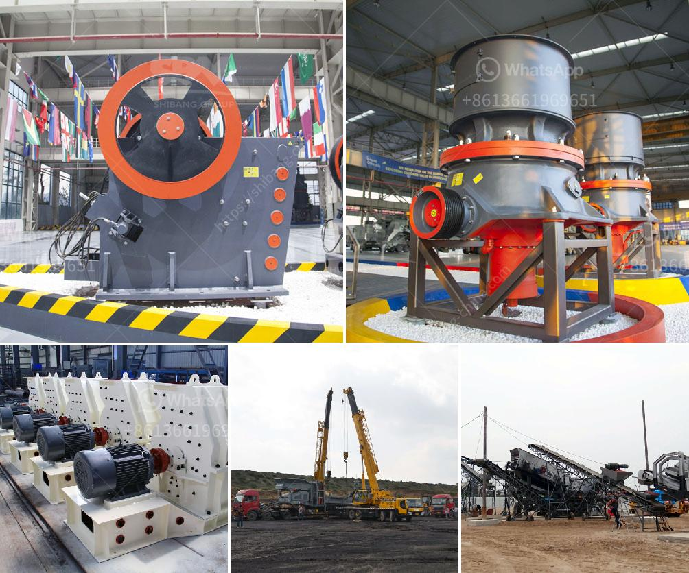

<h3>feasibility study of cement plant project pdf</h3>
A feasibility study of a cement plant project aims to determine the onsite construction and operational stability of a proposed project. The study helps to identify potential obstacles and risks associated with the project and provides plausible solutions to mitigate these risks.

One of the initial steps in the feasibility study is conducting a market analysis. This involves assessing the demand for cement in the local and regional markets. Understanding the market potential helps to determine the plant's production capacity, sales volume, and potential revenue streams.

The study also focuses on the availability of raw materials required for cement production. It evaluates the accessibility and quantity of limestone, clay, and other essential materials within the project's vicinity. This helps to determine the feasibility of sourcing raw materials from local suppliers or if they would need to be imported.

Another crucial aspect of the feasibility study is evaluating the site for the proposed cement plant. Factors such as proximity to transportation routes, availability of utilities, and land availability are assessed. The site should have sufficient space for quarrying, storage, production plants, and administrative buildings.

Additionally, the feasibility study analyzes the technical aspects of the cement plant project. It includes an examination of the cement production process, machinery and equipment required, and the potential cost associated with their installation and maintenance. This helps to estimate the initial investment required for the project.

The study also evaluates the environmental impact of the proposed cement plant project. It considers factors such as air pollution, water consumption, waste generation, and the overall ecological footprint of the plant. Compliance with local environmental regulations and the implementation of sustainable practices are essential considerations.

Financial feasibility is a critical component of the study. It involves conducting a cost-benefit analysis to determine the profitability and return on investment of the project. The analysis takes into account factors such as capital expenditure, operational costs, revenue projections, and potential risks.

Furthermore, the feasibility study assesses the regulatory and legal aspects associated with establishing a cement plant. It encompasses obtaining necessary permits and licenses, compliance with labor laws, and adherence to health and safety regulations.

Finally, the feasibility study concludes with recommendations for the project stakeholders. These recommendations are based on a thorough evaluation of all the factors assessed during the study. The stakeholders can use these recommendations to make informed decisions regarding the viability and potential success of the cement plant project.

In summary, a feasibility study of a cement plant project is a comprehensive assessment that determines the project's viability. It covers aspects such as market analysis, raw material availability, site evaluation, technical feasibility, environmental impact, financial analysis, and compliance with regulations. The study provides invaluable information and recommendations for the stakeholders to make informed decisions and determine the feasibility of the project.
<h3>Contact us</h3><ul><li><strong>Whatsapp:&nbsp;<a href="https://wa.me/8613661969651">+8613661969651</a></strong></li><li><a href="https://swt.shibang-china.com/?git&amp;zhl&amp;feasibility study of cement plant project pdf"><strong>Online Service(chat now)</strong></a></li></ul><h3>Related</h3><ul><li><a href='vertical mill for.md'>vertical mill for</a></li><li><a href='beneficiation plant process line diagram.md'>beneficiation plant process line diagram</a></li><li><a href='cyclone sand separator for sand mining.md'>cyclone sand separator for sand mining</a></li><li><a href='200tpd gold processing plant.md'>200tpd gold processing plant</a></li><li><a href='list of crusher in bharatpur distric.md'>list of crusher in bharatpur distric</a></li></ul>