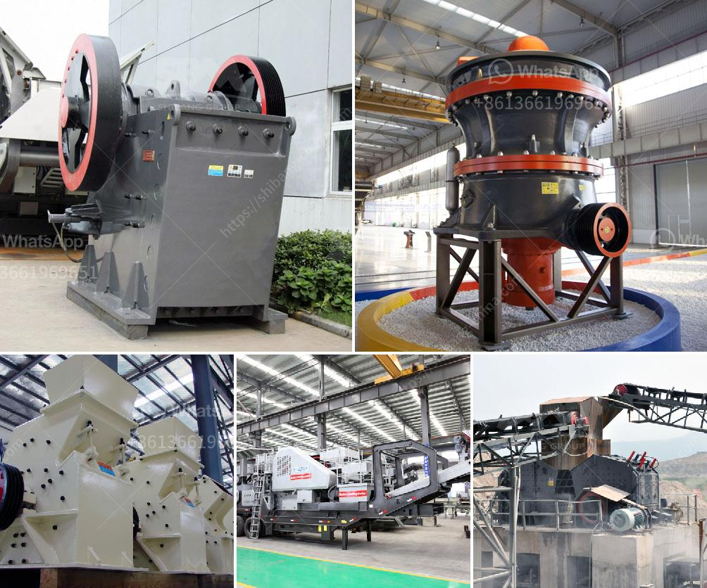

<h3>features a hammer mill</h3>
A hammer mill is a versatile machine used in various industries for efficient and uniform size reduction of raw material. It operates on the principle of impact and attrition where the material is reduced in size by a combination of hammer blows, particle-on-particle contact, and high-speed rotor rotation.

One of the main features of a hammer mill is its ability to produce a wide range of particle sizes. This is accomplished by adjusting the size of the screen mesh through which the material passes. The smaller the screen size, the finer the final product. This flexibility makes the hammer mill ideal for processing different types of raw materials, including grains, wood chips, biomass, and animal feed.

Another key feature of a hammer mill is its durability. The high-speed rotating hammers and heavy-duty construction ensure a long lifespan and low maintenance requirements. The hardened steel hammers can withstand constant impact from the raw material, while the sturdy housing and internal components provide excellent protection and reliable operation.

Additionally, hammer mills offer several advantages in terms of operation and efficiency. They are designed for continuous operation, allowing for a large throughput of material. This makes them suitable for large-scale industrial operations that require high production rates. Moreover, the hammer mill's relatively simple design and straightforward operation make it easy to operate and maintain, even for novice users.

Hammer mills are also known for their versatility in processing different types of feedstock. They can handle both dry and wet materials, and some models are equipped with specialized features to handle sticky or fibrous materials. This versatility makes hammer mills a popular choice in industries such as agricultural, powder processing, and recycling.

In conclusion, a hammer mill is a reliable and efficient machine designed to process a wide range of raw materials. Its ability to produce different particle sizes, durability, and versatility make it a valuable addition to various industries. Whether it's grinding grains, wood chips, or biomass, a hammer mill is an essential tool for size reduction and achieving uniform particle size distribution.
<h3>Contact us</h3><ul><li><strong>Whatsapp:&nbsp;<a href="https://wa.me/8613661969651">+8613661969651</a></strong></li><li><a href="https://swt.shibang-china.com/?git&amp;zhl&amp;features a hammer mill"><strong>Online Service(chat now)</strong></a></li></ul><h3>Related</h3><ul><li><a href='crawler mobile crushers.md'>crawler mobile crushers</a></li><li><a href='used quarry equipment for sale in calgary canada.md'>used quarry equipment for sale in calgary canada</a></li><li><a href='hp cone crusher device.md'>hp cone crusher device</a></li><li><a href='mobile rock crusher for sale.md'>mobile rock crusher for sale</a></li><li><a href='small ball mill for alumina.md'>small ball mill for alumina</a></li></ul>